# 跨层教程

## 跨层线

### 新建图层

点击新建图层, 建立一个新的线图层.

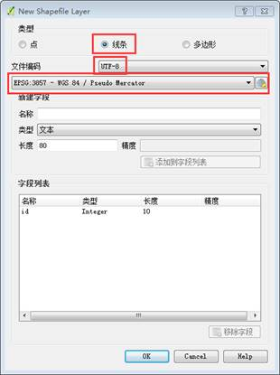

### 添加字段

新建的图层只有一个 id 字段, 现在我们需要给它添加跨层线的需要的字段: i, j, length, reverse(都是 10 位整数, 线只有这四个属性, id 字段可以删除)

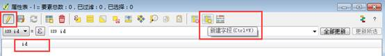

下图为添加后的字段:

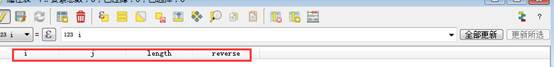

### 复制线

将单层的线复制进跨层线的图层.选中需要复制的图层

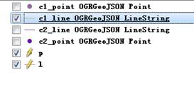

ctrl+a(全选), 再 ctrl+c(复制), 再选中跨层线的图层 ctrl+v(粘贴)

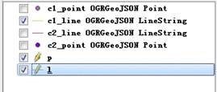

下图为复制粘贴后:

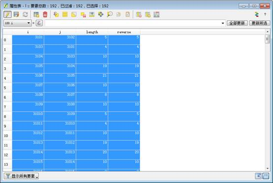

剩余的依次复制后需要平移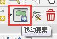(平移时一定要选中所有需要平移的内容), 稍微错一下位, 方便连跨层线.

### 连接跨层线

打开编辑, 添加要素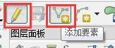, 并在设置里面把吸附打开, 吸附模式为`当前图层`, 吸附内容为顶点, 容差根据实际情况调整.
连线时可将跨层点的 name 标签打开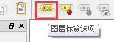 , 可根据 name 显示的内容来作为参考.

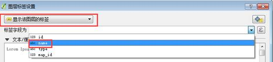

## 添加跨层线的 i, j 值

新画的跨层线是没有 i, j 值的, 这时需手动添加, 添加时按 i, j 所对应得点的 id 来填写, 没有左右之分.填写时可将跨层点图层的 id 标签打开.
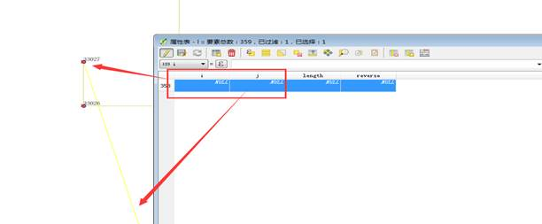

## 跨层点

只用于对连接跨层线时做一个参考, 便于跨层线的连接, 对跨层数据没有实际的的作用
