# 匹配末端点的属性

## 图层连接

用线图层连接点图层

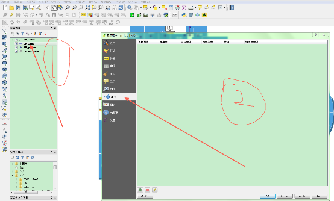

点击右下角的 `+` 号

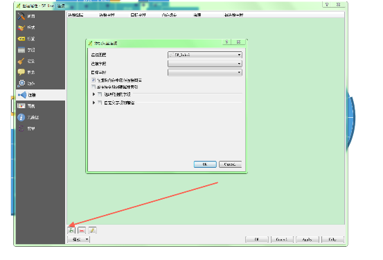

连接图层选择为:点图层, 连接字段选为:Id, 目标字段: `i`

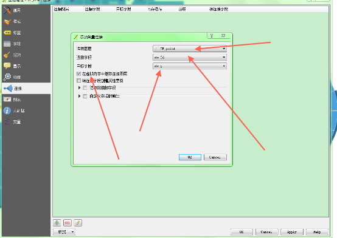

点击 `ok` 按钮, 并将此线图层另外存为一个简单的名字, 比如: `i`

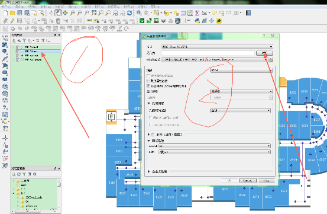

## 取消连接

继续使用线图层, 连接点图层, 并将上次连接记录取消

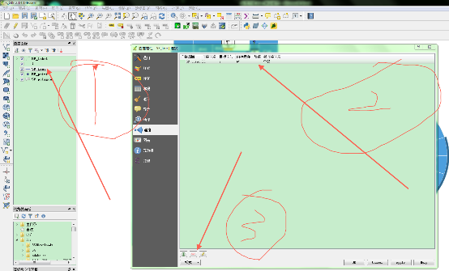

取消连接后, 再如前边步骤, 点击 `+` 号, 重新设置连接属性, 如下图:

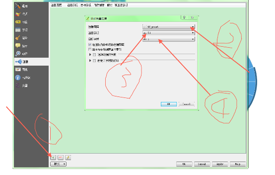

点击 `OK` 后, 将线图层存为: `j`

## 删除数据

分别删除 i 图层, j 图层为空的属性

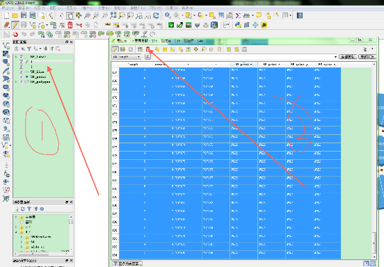

同样道理删除 j 图层;

## 点线连接

用点图层分别去连接 i, j 图层

连接方式和前边 2 页的链接方式一样, 属性设置如下图(务必保持, 图层, 连接字段, 目标字段一致)

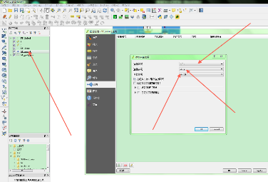

连接完成后, 接着处理点图层的属性, 将已经连接过来的属性全部赋给点的属性, (下图中 1,2,3,4 种属性, 全部赋给点本身的属性)

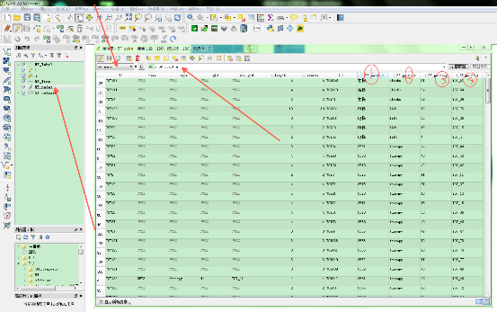

然后点击全部更新, 这样就将 i 图层里的属性全部匹配到点图层了;

同样道理, 再用点图层继续匹配 j 的属性(注意:连接图层, 连接字段, 目标字段一定要选正确)

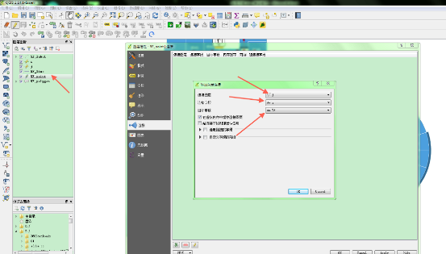

接下来, 继续处理点图层的属性

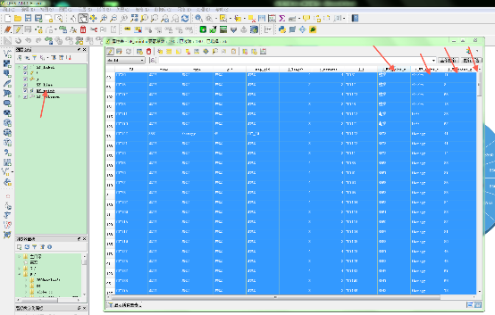

选中点图层里边 j 的不为空属性, 全部分别赋给点的属性; 赋值时选择更新所选

## 检漏

打开点图层的标签, 显示标签的 name 属性, 大致检查是否有点匹配漏掉, 如下图

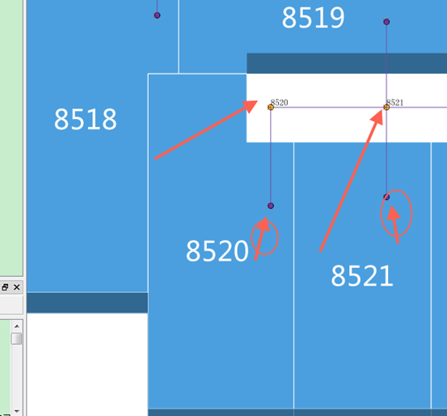
