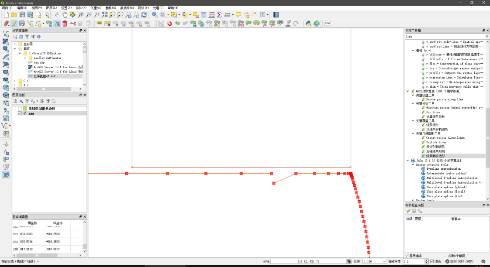
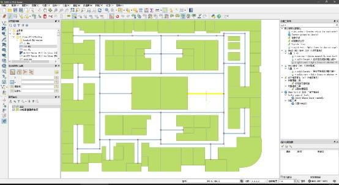
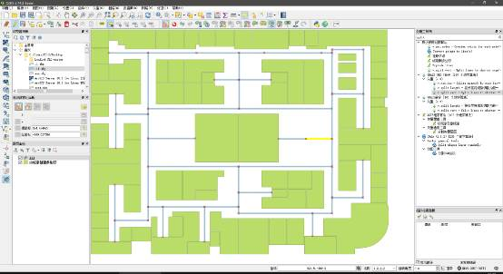
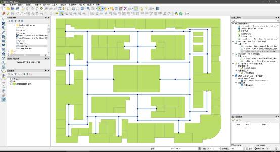
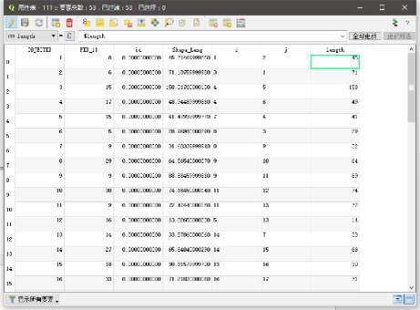

# 矢量地图绘制工作手册

## 加载 DXF 文件

1. 点击左侧工具栏中的 `添加矢量图层` 加载 DXF 文件


2. 在弹出的面板中, `源类型` 选择 `文件`; 编码选择 `UTF-8`, 然后打开文件


3. `在坐标参照系选择器` 中, 在 `过滤` 栏中输入 `3857`, 然后选择 `管理机构标识符` 为 `EPSG 3857` 的坐标参照系


4. 在 `请选择要添加的矢量图层` 面板中只选择 `线图层`


5. 在弹出的对话框中, 直接选择 `最近使用过的坐标参照系` 栏中的 `EPSG 3857`


6. 导入文件


## 导出.SHP 文件

在图层面板中, 选择刚才导入的线图层, 右键 - 另存为


图层面板中就会多出一个另外存储好的文件


## 检查线完整性并修复

1. 点击工具栏中的 `拓扑结构检查器`


2. 在右下角出现的 `拓扑检查面板` 中点击 `设置`


3. 在 `拓扑规则设置` 中, 左边下拉栏中选择之前另存为的图层, 右边下拉栏中选择 `不允许有悬挂` (这里选择的是线不允许有悬挂, 即线应为闭合线)


4. 在 `拓扑检查面板` 中, 勾选下方的 `显示错误`, 再点击 `全部检验`


如果有错误, 会以红点标注在图中相应位置


5. 修复线连接性, 进入 `编辑模式`, 选择 `节点工具`


6. 打开设置-吸附选项


设置 `吸附模式`, `吸附点` 及 `容差值`


7. 对悬挂点进行拖拽, 使其吸附到另一个节点.




## 运用转换工具将线转换为面

(注 本文因面图层存在图形缺失问题, 故导出线图层, 若面图层完整, 则直接导出面图层而不需要进行类型转换)

1. 在屏幕右边 `处理工具箱` 中搜索 line, 运行 `线条到多边形` 工具


2. 在 `线条到多边形` 面板中, 运行 `保存到文件`


编码一定改为 `UTF8`


最后点击 `运行`

图层面板中就会多出刚刚由线创建的多边形图层


## 新建路网

1. 新建 shapefile 图层


2. 在 `New Shapefile Layer` 面板中, 选择 `线条`; 编码只能为 `UTF-8`; 坐标系为 `EPSG 3857`


3. 绘制路网, 打开 `编辑` 模式, 并点击 `添加要素`


4. 在空白处点击右键, 打开 `高级数字化面板`


点击 `启用`, 可以保持线条的水平垂直走向


5. 左键点击开始绘制, 单击左键添加折点, 右键结束绘制


:::tip
这里可将吸附设置中的对象改为全部图层
:::

结束并保存绘制


## 按折点将路网切分

1. 打开 ArcMap, 点击, 在弹出的面板中点击选择文件夹再添加之前编辑好的路网文件


2. 运行 `ArcToolBox` - `数据管理工具` - `要素` - `要素转线`


3. 在 `ArcToolbox` 列表中选择 `数据管理工具` -- `要素` -- `要素转线` 命令


4. 在 `要素转线` 面板中, 在 `输入要素` 下拉栏中选择要转换的图层, `输出要素类` 中选择好存储的文件夹及文件名


转换好后, 图层面板中就会多出

要素转线仅将交点处分割, 对于拐角处并没有完全切分, 需继续点击 `要素` 中的 对 `路网分割` 图层进行全部切分


5. 转换好的 `.shp` 文件可以直接拖入 QGIS 的图层面板中


如果在 ArcGIS 中工具运行失败, 请返回 QGIS 检查道路是否存在长度为 0 的道路, 并将其删除.或者运行拓扑检查工具, 删除无效的道路.


## 添加路网额外折点

在需要增加标识的地方路段添加折点, 即对线段进行切分


比如在高亮线段处红色点有一个大屏, 我们需要在此处添加一个折点使其能够作为导航起始点.

1. 进入 `编辑` 状态, 再点击 `分割要素`


2. 在需要切分线段两侧单击, 形成切割线, 右键完成编辑





## 安装 networks 插件

QGIS 插件-管理并安装插件-搜索 networks-安装插件


Networks 插件默认安装在 `菜单栏` - `矢量` 选项中


## 编码路网并生成节点

1. 点击 `矢量`, 选择 `Networks` --Build Graph


2. 在弹出的对话框中勾选 `Load node layer in active map`, 然后将点的 SHP 文件存储在相应文件夹中


此插件将对当前选择中的线图层进行编码, 并生成对应节点, 弹出对话框为保存的节点名字与路径.

:::tip
prefix 为节点编码前缀, 一般根据项目的 prefix_id 填写; `Load node layer in active map` 是将生成的点图层添加到当前面板中
:::

若是不能成功生成点图层, 则检查线是否是由多段线绘制(由 cad 绘制另存为的 dxf)



## 检查路网与折点的匹配关系

1. 点击 `图层标签选项`, 显示点图层的标注


2. 检查是否存在重合点, 缺失点的情况.如缺失或重合, 需对线图层进行修复编辑, 再重做路网编码与节点生成.


## 对线图层添加属性(道路长度)

1. 在图层面板选择所需编辑的路网图层, 右键点击 `打开属性表`


2. 在 `属性表` 面板中, 点击开始编辑, 再点击新建字段

3. 在 `添加字段` 中, `名称` 中输入 `length`, `长度` 中输入 `10`


结果如图


4. 选定字段计算器类型为 `length`, 进行编辑


5. 在 `表达式对话框` 中, 输入表达式为 `$length`,


再进行 `全部更新`




length 即线段长度值.

## 添加反向道路长度

1. 在路网图层的属性表中, 新增字段 reverse, 运行字段计算器 `reverse = length`


2. 再点击 `全部更新`


## 对点图层添加属性

若点图层无法显示, 使用`矢量` - `数据管理工具` - `定义当前投影`, 将坐标系定义到 `EPSG 3857`


1. 打开点图层属性表, 打开编辑, 添加字段 name, 类型为 `文本`, 长度为 `50`


2. 对照图形, 用选择按钮选取需要的点.


属性表窗口中左下角将显示所有要素切换为显示选中要素

 

在 name 栏中输入折点名字, 如 `肯德基`


或者使用多项选择, 然后在字段计算器进行编辑


更新所选即可.

## 数据导出格式要求

数据导出均以 GeoJSON 格式导出


```
格式: GeoJSON
坐标系: EPSG 3857
编码: UTF-8
命名方式: `{map_id}_{地图名}_{图层类型}` (全以数字和英文标注)
命名示例: `689_4F_polygon`, `689_B1_line`, `689_B1_point`
其他: label 图层不需要导出
```

:::warning
689 为项目的 map_id 每个项目以及每层数据的 map_id 都是唯一的
:::

矢量地图还需要导出一份文件

```
格式: GeoJSON
坐标系: EPSG 4326
编码: UTF-8
命名方式: `map{类型}_{map_id}`
命名示例: `mapPolygon_689`, `mapLabel_689`
```

## 样式导出格式要求

.qml 文件导出, 详细文档见样式设置手册
