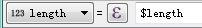
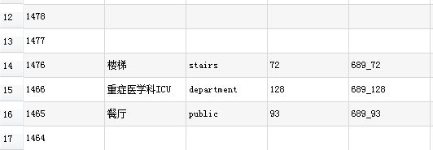

# 绘图流程

## 绘图详细步骤

1.  常规绘图顺序: dwg→dxf→polygon→line→point→/label/style→ 切片, 简单概括: 面, 线, 点;
2.  根据项目方提供的 `CAD` 原文件画出线框图, 并存为 `dxf` 格式文件;
3.  在 qgis 中载入绘制好的 `dxf` 文件, 生成 `面图层(polygon)`, 并添加属性, 配置样式;
4.  绘制 `路网(line)`;
5.  用绘制好的路网生成 `点图层(point)`;
6.  给点图层匹配面图层的 `属性`;
7.  用面图层生成 `标签点图层(label)`, 并配置样式;
8.  加载已配置好的 polygon 和 label 的样式, 完成切片地图;
9.  将 `面图层(polygon)`, `标注点图层(label)` 投影为坐标参照系为 4326 的 GeoJSON 文件, 完成矢量地图.

## 面图层 polygon

### polygon 的属性

属性包括: name, type, gid, map_gid, context, cate_id

属性类型: 都是 `文本 50 位`, name_en 为文本 200

### 矢量数据

polygon 数据投影为坐标系为 4326 的 `GeoJSON` 文件

### polygon 的样式

在 polygon 的属性添加完毕后就需要给 polygon 写样式, 根据配好的颜色来逐一添加, 对应字段为 `type`

### polygon 属性字段名词解释

- `map_id`: 点线面都和 map_id 有密切的关联, 但它在不同的图层中存在的方式是不一样的, 它表示的意思是在后台生成的列表中的编号.

- `name`: 名字, 名称;

- `type`: 样式分类, 区别不同颜色;

- `gid`: 与点相匹配的符号, `面的 gid 都是唯一的`. 但点的 gid 可以有多个相同的, 这说明了一个面相对应的点有多个, 如在地图中一个商场的出入口有多个, 整个商场在面图层中可以看做是一个面, 有一个唯一的 gid, 而多个出入口则是点图层中具有相同 gid 的多个不同的 id 的点. `生成方式`: 

- `map_gid`: 面图层在后台列表中对应编号, 生成方式为 map_id+gid, name 不为空才有 gid, 有 gid 的才有 map_gid; map_id 为后台列表每层数据对应的编号, 有其唯一性.

- `context`: 快捷分类, 公共设施 public, 其他 spots;

- `cate_id`: 根据不同的需求添加不同的分类,具体数值根据项目后台生成然后填入相应数据. 只要可点击面, 就应有相应的 cate_id.

## 线图层 line(路网)

### line 的属性

属性包括: i, j, length, reverse

属性类型: length, reverse 为整数 10 位, i, j 是在生成点图层时, 自动生成.

### 绘制路网

绘制路网有两种方式, 一种是在 CAD 中绘制, 存出 dxf 文件在 qgis 中生成 line, 一种是在 qgis 中新建 line 图层, 直接绘制. 请根据实际情况选用适当的绘制方式.

::: tip 建议
绘制路网时, 线一定要画到面里面一点点, 方便后面点匹配属性.  
:::

### 路网切分

不管是用 CAD 还是 qgis 绘制的路网都需要到 ArcMap 中进行打断, 具体操作步骤:

→ → → → 生成的文件 →;

### line 名词解释

- `i, j`: 描述线的始末的点的 id, 所有的 i, j 都是由线生成的点的 id 构成的. i 是始, j 是末. 在单向通过时需注意 i, j 的方向.

- `length, reverse`: 正向长度和反向长度. 生成方式: , ;

## 点图层 point

### point 的属性

属性包括: id, name, type, gid;

### 生成方式

→ → → 

上图的 `14` 为 `prefix_id`

毎个项目起始的 prefix_id 都为 10. 如果为多层数据则每层 prefix_id 不相同.

### 匹配属性

搜索框搜索“位置”, 找到按位置连接属性

::: warning 注意
目标图层是 point, 连接图层是 polygon, 几何关系是内含于, 精度大于 0.1, 但不要过大, 保留全部记录, run(运行)即可.  
:::

### 字段精简

删除匹配后多余的 `map_gid` 字段

### point 名词解释

- id: 线生成的点的序号. 每个点的 id 都是唯一的.

如上图的 1476, 14 是 `prefix_id`, 76 是序号.

- name, type, gid 同 polygon.

- 跨层点的 type 如楼梯, 扶梯, 电梯应改为楼梯 - stairs, 扶梯 - escalator, 电梯 - lift. 跨区点应添加相应的 name, type(填 gate).

## 标签点图层 label

### 矢量地图 label 图层需另存为 GeoJSON_4326 数据.

### label 的属性

属性包括: label, type, map_gid 等, 无限制(根据需求).

### label 的生成方式

polygon 中 name 不为空的元素的质心点, 所以 label 继承了 polygon 的 name, type, gid, map_gid 等属性.

### 额外字段

在需要适应到 GPS 的场景中可点击图标时, 需加字段 X, Y 坐标字段. 需要注意的是必须在 4326 坐标系下生成相应的 X Y 坐标. (相应的公式 X=$x, Y=$y)

### label 的样式

label 在切片使用时, 它的数据不上传.

根据填入 label-type 的不同 label 中的标签可分为两种, 文字标签和图标. 地图是可以放大或缩小的, label 的样式也需要设置对应的等级来调整 文字和图标的大小.

## 数据保存

- 在面图层(polygon), 线图层(line), 点图层(point)都编辑完成时将数据都另存为 GeoJSON_3857(坐标参照系为 3857)的文件,并上传.

命名方式为 689_1F_polygon, 689_1F_line, 689_1F_point.

- 矢量地图做法: 在面图层(polygon), 标注点图层(label)编辑完成后另存为 GeoJSON 文件(坐标参照系为 4326), 并上传.

命名方式为 mapPolygon_689, mapLabel_689. 689 是 map_id

- 切片地图做法: 在面图层(polygon), 标注点图层(label)编辑完成后, 加载已配置好的 polygon 和 label 的样式, 根据所需缩放等级, 完成切片并上传.

::: tip
在绘制的过程中请随时点保存
:::
