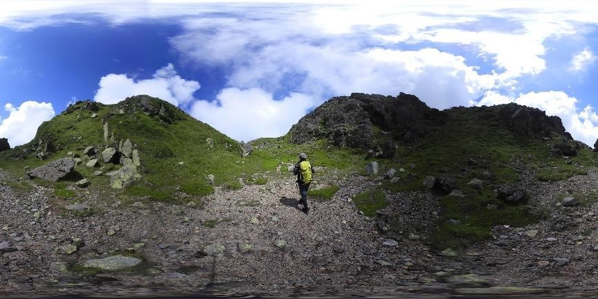

# 360 全景照片使用手册

## 全景照片简介

全景对于球体来说, 所处的空间状态, 视角涵盖地平线+/-各 180°, 垂直+/-各 90°; 就立方体的空间状态, 即为上下前后左右六个面完全包含. 尤于水平角度为 360°, 垂直为 180°, 能表达这种模式的照片有很多种, 又跟球面的投影有关(类似绘制世界地图的投影, 但是是内投影).

目前最广泛使用的单一照片呈现法是等距长方投影(equirectangular), 全景照片的长宽比例固定为 2: 1, 我们使用的也是这种方法.

## 拍摄设备简介

使用的设备是尼康 keyMission360, 是一款能够通过手机进行远程控制拍摄, 并直接生成 equirectangular 类型全景图片的相机, 拍摄精度默认为 7744 x 3872, 可进行图片、视频两种类型的拍摄.

详细介绍见[相机文档](http://www.nikon.com.cn/sc_CN/product/keymission/%E9%92%A5%E5%8A%A8keymission-360#overview)

## 使用方法简介

1. 下载 SnapBridge360 APP 并安装

2. 将相机固定在脚架上, 并使相机前方面朝地图北方(不是地磁北方)

3. 长按相机电源按钮 7~10s 至绿灯闪烁, 打开手机 APP, 在 APP 中启用蓝牙和相机配对

4. APP 中选择遥控拍摄, 此时手机与相机发出的 WIFI 进行连接, 会导致无法上网

5. 点击左下角拍摄按钮进行拍照(此时相机会闪烁, 2s 后拍摄成功)

6. 等待相机拍摄的照片传回手机(此时会有 2-3s WIFI 传输等待), 点击详情, 在地图上记录当前点位对应照片的时间.

详细说明书见[相机说明书](<http://download.nikonimglib.com/archive3/6j8up00X6KiM02Pa1Hg852SdFk88/KM360RMPRC_(Sc)05.pdf>)

## 全景照片拍摄

### 拍摄需求

根据全景导视的展示方法, 分为两种类型, 一种是起点的全景导视, 另一种是分布式, 二者最大差距在于需要拍摄的全景图数量存在较大差距.

1. 起点处的全景图只需要在所有存在二维码以及蓝牙的地方拍摄全景图.
2. 分布式需要拍摄图纸上所有有节点标注的点位的全景图.

### 前期准备

1. 地图图纸: 打印的绘制地图图纸, 包括节点、路线与二维码点位标注.
2. 相机电池: 原装 1 块+备用 2 块, 原装电池使用充电线充电, 备用电池使用备用充电器充电.

原装电池满电状态下能够使用 2 小时, 备用最多 1 小时, 因此尽可能多的备够电池, 更换电池会大大降低拍摄效率.

### 拍摄标准与注意

1. 相机前方面朝地磁北方, 通常是打开手机罗盘, 当角度为(0±15)度时进行拍摄.
2. 拍摄时拍摄者尽可能躲开拍摄视角, 如无遮挡区域或者区域范围较大导致蓝牙断开连接, 可蹲至三脚架下方拍摄.
3. 建议拍照人数 2 人, 一人固定相机并拍照, 另一人记录点位和拍摄时间(拍摄时间以相机详情中记录的时间为准).
4. 拍摄时尽可能选择人较少的时候进行拍摄, 要求 5m 以内最多存在 1 人, 因此拍摄通常选在晚上或者清晨.
5. 拍摄时需要保证外界环境的亮度, 室外拍摄需要选在白天或者灯光较充足地区拍摄.
6. 拍摄时注意是否打开了录像模式, 此模式会大量消耗电池, 影响拍摄时长.

### 照片标注与纪录

拍摄结果以时间对各节点进行标注, 在图纸上用数字标注拍摄点位, 在表格中填写对应的时间, 时间精确到秒. 地图偏角指使用的图纸为正北方时与地磁北方的夹角, 使用手机罗盘获取当前地图偏角.

| 编号 | 楼层 | 时间     | 地点         | 日期              | 地图偏角 | 拍摄人 |
| ---- | ---- | -------- | ------------ | ----------------- | -------- | ------ |
| 1    | 1F   | 14:20:38 | 成都 XX 医院 | 2019 年 1 月 1 日 | 0°       | 张三   |
| 2    | 1F   | 14:21:50 | 成都 XX 医院 | 2019 年 1 月 1 日 | 0°       | 张三   |

## 全景照片处理

### 处理方法

1. 删除拍摄效果不佳的照片(由拍摄人员完成)
2. 使用 adobe PhotoShop 将图像进行亮度、对比度调整(此步骤可以交给图形部门完成, 需要使用原图)
3. 使用 【脚本-图像处理器】进行批量图像压缩处理(由拍摄人员完成)

### 处理要求

1. 导出的图像精度为 3000 \* 1500
2. JPG 品质为 5

### 参数设置

1. 对于 iOS 系统, 默认罗盘跟随, 关闭全景图滑动, 不使用图像旋转动画, 初始化方向为当前面朝方向
2. 对于 Android 系统, 默认不开启罗盘跟随, 启用全景图滑动, 使用初始化方向旋转动画, 初始化方向为需要前进方向
3. 为了遮挡拍摄时的三脚架, 使用默认俯角 60°

### 文件传输与点位绑定

1. 所有纸质文件需转为电子档, 即带有时间标注的图纸与表格需要保存为电子档, 对着图纸拍摄的照片不能作为电子存档.
2. 拍摄的数据如需快速呈现, 则将压缩后的全景图与电子档记录表发送给数据图形部门, 完整的全景图待处理后再发送. 3.数据图形部门按照时间与地图节点进行匹配并上传至服务器.
