# 矢量地图缩小流程

## 方法一

### 绘制 DXF 文件

1. 根据项目方提供的 CAD 原文件画出线框图，并存为 dxf 格式文件

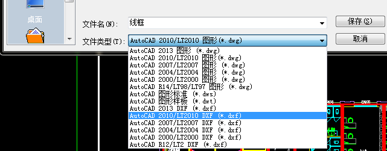

### 加载 DXF 文件

1. 点击左侧工具栏中的 `添加矢量图层` 加载 DXF 文件

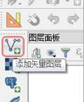

2. 在弹出的面板中, `源类型` 选择 `文件`; 编码选择 `UTF-8`, 然后打开文件

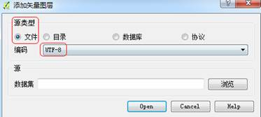

3. `在坐标参照系选择器` 中, 在 `过滤` 栏中输入 `3857`, 然后选择 `管理机构标识符` 为 `EPSG 3857` 的坐标参照系

4. 在 qgis 中载入绘制好的 dxf 文件（坐标参照系为 3857），生成面图层（polygon）

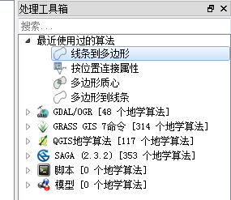

### 导出.GEO 文件

1. 另存为 geojson 文件，坐标参照系为 4326

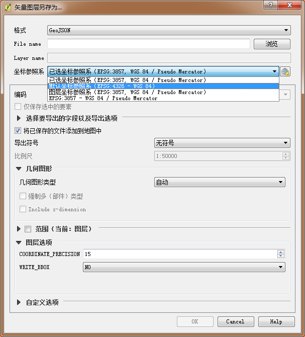

### 缩小.GEO 文件

1. 打开 `橙立科技工具包`, 安装包在 [seafile 同步盘](http://192.168.1.228:9999/library/ae96962c-2b07-40a8-9876-a1483c396979/APK%20%26%20EXE/) 下载, 选择`地图处理`选项卡

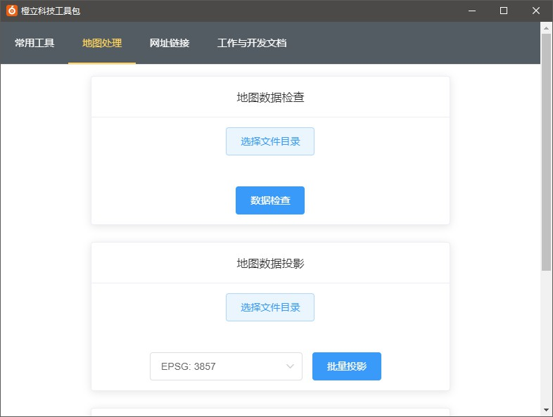

2. 找到地图数据缩放工具, 选择需要转换的 geojson 文件目录, 输入需要缩放的比例, 默认值为 0.95

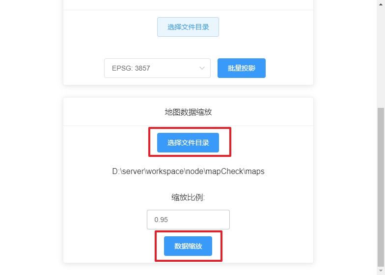

3. 点击数据缩放按钮, 缩放后的文件夹会存储至桌面 `scalePolygon/` 文件夹里

### 导回.SHP 文件

1. 在 maps_new 中得到已缩小过后的 geojson 文件，载入到 qgis 中，同时载入最开始线框转为 shapefile 的 polygon 面图层。

- 将 shapefile 文件（原文件）除了最底面，其余底面全部删除；
- 将 geojson 文件（缩小文件）的最底面删除，其余底面全部复制粘贴到 shapefile 文件中。（即最底面无需缩小）

2. 此时因为缩小后所有图形整体缩小，所以有部分墙体需要手动移动，将代表墙体的面移动到附近代表商铺（或者房间）的面旁，如：

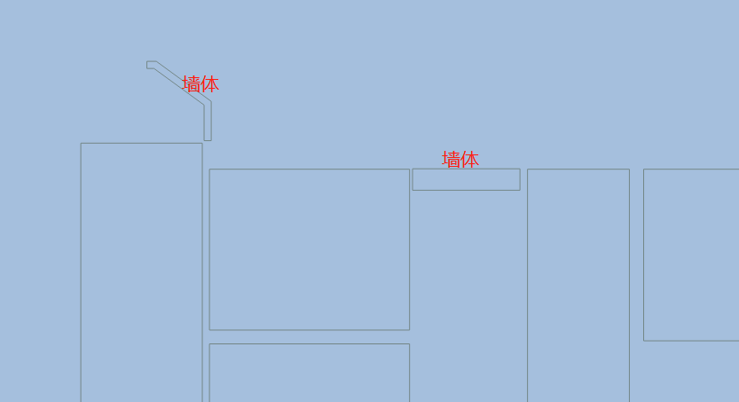

改为：

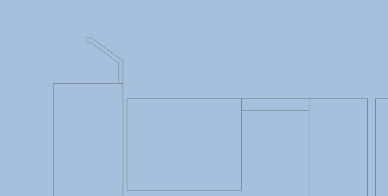

还有的其他底面因为是异形，所以缩小后不符合实际，就需要手动调整让它与其他面不相互重合，改的更加美观合理。

4. 在将缩小后的面调整合适以后，便可以添加属性、配置样式。（后续绘制流程请看绘图流程）

## 方法二

### 绘制 DXF 文件

1. 根据项目方提供的 CAD 原文件画出线框图，并存为 dxf 格式文件

### 加载 DXF 文件

1. 点击左侧工具栏中的 `添加矢量图层` 加载 DXF 文件

2. 在弹出的面板中, `源类型` 选择 `文件`; 编码选择 `UTF-8`, 然后打开文件

3. `在坐标参照系选择器` 中, 在 `过滤` 栏中输入 `3857`, 然后选择 `管理机构标识符` 为 `EPSG 3857` 的坐标参照系

4. 在 qgis 中载入绘制好的 dxf 文件（坐标参照系为 3857），生成面图层（polygon）

### 导出.SHP 文件

1. 另存为 Shapefile 文件，坐标参照系为 3857

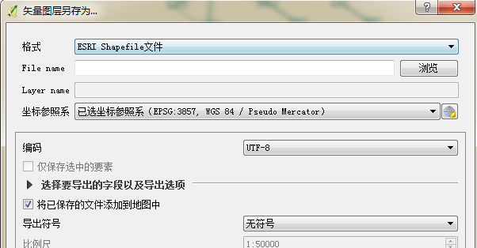

### 缩小.SHP 文件

1. 打开 [scale.py](https://o.signp.cn/js/scale.py)，拉到最低处，设置 SHP 文件的输入输出位置，并输入想要缩小的值，将刚才另存为的 SHP 文件放进输入文件中，在输入文件里建一个新的无属性的 SHP 文件；

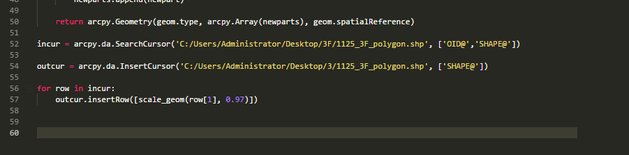

1. 打开 ArcMap，载入输入文件（SHP)，点击上方工具栏的 Python，并输入 execfile（），将文件 `scale.py` 拖入进括号中按回车键即可

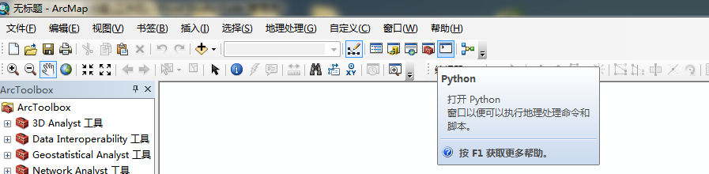

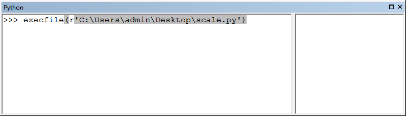

### 保存.SHP 文件

1. 在输出文件中得到已缩小过后的 Shapefile 文件，载入到 qgis 中，同时载入最开始线框转为 shapefile 的 polygon 面图层。

- 将 shapefile 文件（原文件）除了最底面，其余底面全部删除；
- 将 shapefile 文件（缩小文件）的最底面删除，其余底面全部复制粘贴到 shapefile 文件中。（即最底面无需缩小）

2. 此时因为缩小后所有图形整体缩小，所以有部分墙体需要手动移动，将代表墙体的面移动到附近代表商铺（或者房间）的面旁，如：

改为：

还有的其他底面因为是异形，所以缩小后不符合实际，就需要手动调整让它与其他面不相互重合，改的更加美观合理。

4. 在将缩小后的面调整合适以后，便可以添加属性、配置样式。（后续绘制流程请看绘图流程）

## 方法三

### 绘制 DXF 文件

1. 根据项目方提供的 CAD 原文件画出线框图，但在绘制时如图所示，手动控制两个面的距离，视为已经缩小，然后所有面依次画出后另存为 DXF 格式文件。

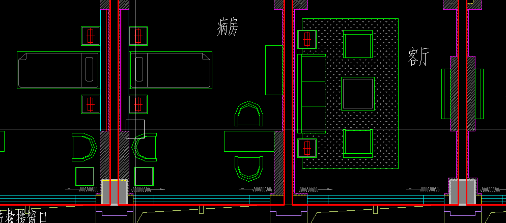

### 加载 DXF 文件

1. 点击左侧工具栏中的 `添加矢量图层` 加载 DXF 文件

2. 在弹出的面板中, `源类型` 选择 `文件`; 编码选择 `UTF-8`, 然后打开文件

3. `在坐标参照系选择器` 中, 在 `过滤` 栏中输入 `3857`, 然后选择 `管理机构标识符` 为 `EPSG 3857` 的坐标参照系

4. 在 qgis 中载入绘制好的 dxf 文件（坐标参照系为 3857），生成面图层（polygon）

### 导出.SHP 文件

1. 另存为 Shapefile 文件，坐标参照系为 3857

2. 添加属性、配置样式。（后续绘制流程请看绘图流程）
