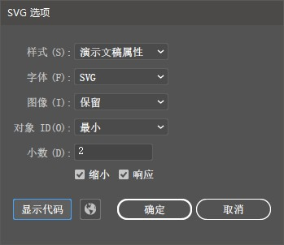
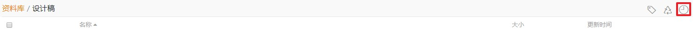

# UI 设计流程与规范

设计参考

- [Ant Design 设计理念](https://ant-design.gitee.io/docs/spec/introduce-cn)
- [Material Design](https://material.io/)
- [Material Design 汉化版](https://www.mdui.org/design/)
- [Lightning Design System](https://lightningdesignsystem.com/getting-started/)

## 设计软件与格式

### 设计稿标准文件

设计稿根据设计师的系统差异存在不同, 一般的:

| 系统          | 软件       | 格式      |
| ------------- | ---------- | --------- |
| Mac OS        | `Sketch`   | `.sketch` |
| Windows       | `Adobe XD` | `.xd`     |
| Windows(可选) | `Lunacy`   | `.sketch` |

在能够保证网络与稳定代理的前提下, 推荐使用 [Figma](https://www.figma.com/) 作为在线设计稿编辑与共享软件, 支持 `.sketch` 文件的导入, 不做强制要求. [Figma 教程](https://figmachina.com/guide/).

:::tip 提示
一般的, 矢量文件的通用格式为 `svg`, 可以通过将画板导出为 `svg` 用于不同软件的协作, 包括但不限于 `Sketch`, `Adobe XD`, `Adobe Illustrator`, `Figma`, `CorelDRAW` 等.

svg 文件在共享时文本格式需要设置为为 `svg文本`, 转为`轮廓`会丢失矢量图形信息.
:::

### 图标文件

图标文件使用 `Adobe Illustrator` 进行编辑与绘制, 参考[图标设计模板](http://192.168.1.228:9999/lib/a9db064d-b372-4c9b-ae73-c01a973b2426/file/icon_product_1024.ai), 源文件保存为 `.svg` 格式.

一般的, **几乎所有** 图标要求使用矢量方式进行绘制, 在需要导出为栅格图标时, 导出成 `.png` 格式.

在特殊情况下(一般是在无法找到原 png 图标的原文件时), 可通过 `Adobe Photoshop` 修改图标相应信息, 并保存导出.

`svg` 图标导出时需要进行压缩, 压缩可通过 `Adobe Illustrator` 导出工具导出, 或者通过 [svg 压缩工具](https://jakearchibald.github.io/svgomg/) 默认配置压缩导出.

注意:

- 可换色 `svg` 图标要求填充色选择为 `套版色`.
- `svg` 文件大小控制在压缩后 `5k` 以内, 如果出现超大图标, 检查是否使用了 `栅格图像`.

## 设计稿目录与同步

为了对设计稿进行版本记录与文件同步, 要求使用 [seafile 同步盘](http://192.168.1.228:9999/library/6eac45bd-b3a7-4272-8c79-f6d31531c581/%E8%AE%BE%E8%AE%A1%E7%A8%BF/)进行文件同步.

### 使用说明

[seafile 客户端下载地址](https://www.seafile.com/download/)

[seafile 桌面客户端使用说明](http://192.168.1.228:9999/help/)

seafile 桌面客户端要求`开机自启`.

- 服务器: `http://192.168.1.228:9999`
- 账号: `123456@qq.com`
- 密码: `123456`

### 注意事项

- 设计稿按不同项目`分文件夹`储存.
- 设计稿文件夹增加`拼音首字母`方便查找.
- 设计稿不需要保存多个版本, seafile 自带`版本历史记录`, 在需要查找历史记录时, 可通过查看历史记录找回以前版本.
  

## 设计稿沟通

项目设计稿使用 [蓝湖](https://lanhuapp.com/) 进行设计稿的同步与沟通.

要求设计师与开发人员均`注册蓝湖账号`.

对于 `.sketch`, `.xd` 设计稿源文件, 需要在本地安装 [摹客](https://www.mockplus.cn/download/idoc-xd) 或者 [蓝湖扩展插件](https://lanhuapp.com/xd) , 并按照对应的操作上传设计稿.

上传的设计稿需要将设计稿链接`分享`给开发人员, 开发人员可直接使用设计稿的标注与切图用于产品制作.

## 图标设计

### 参考

图标设计原则借鉴 [Ant Design 图标设计原则](https://ant-design.gitee.io/docs/spec/icon-cn).

### 规格

所有图标都是按照 `1024 * 1024` 的画板进行制作, 导出以 `64 * 64` 为标准大小

图形分为 3 层:

- 画板层: 背景画板, 包括 `64 * 64` 的预留空间.
- 轮廓层: 用于外框线绘制, 根据图标样式不同分不同大小.
- 图形层: 用于图标匹配与图形导出.

### 中心位置

- 所有的图标中心位置: `X: 512; Y: 512`.

<!-- ### 轮廓线与图形模板大小

常用的图标轮廓线与图形模板大小如下:

| 分类     | 大小        | 图像最小宽/高 |
| -------- | ----------- | ------------- |
| 方形轮廓 | `800 * 800` | `25 * 25`     |
| 矩形轮廓 | `704 * 896` | `22 * 28`     |
| 圆形轮廓 | `896 * 896` | `28 * 28`     |
| 方形图形 | `608 * 608` | `19 * 19`     |
| 矩形图形 | `608 * 704` | `19 * 22`     |

- 图像最小宽/高是指在 UI 设计稿中, 图标元素可用的最小设计大小.
- 图标元素大小只能使用`最小宽高的整数倍`.
  - 方形轮廓可以使用的大小可以有 `25, 50, 75...`.
  - 方形图形可以使用的大小可以有 `19, 38, 57...`.
  - ... -->

### 建议

- 移除多余节点, 保持图形的整洁.
- 合并图形, 便于输出.
- 对小数点以及奇数进行最后一遍的走查与修正.
- 简化图层结构.
