# 互动展板功能文档

## 启动流程图

## 运行过程

1.  进入互动展板 app 显示当前 app 版本号和当前设备序列号
2.  第一次进入 app 会有动态权限授予, 目前最新设备可以不用手 动点击了(目前屏幕所以权限都已获取到)
3.  权限授予完成后 检查网络是否可用, 如果没网 显示设置网 络按钮 如果 WiFi 没打开 第一次会自动打开(之后需手动打开)
4.  网络情况
    - 有网络
5.  设备认证
    - 设备认证成功
6.  检查 APK 升级是否需要升级
    - APK 需要升级, 去下载最新的 APK 包下载完成, 静默安装自动重启 APP
    - APK 不需要升级
    - 等待基础数据的下载
    - 等待设备认证
    - 后台认证设备后 重启设备
7.  基础数据下载完成
    - 本地资源存在且完整, 直接使用本地资源 进入首页
    - 不存在本地资源
8.  下载本地资源
    - 下载资源解压成功
9.  进入首页
    - 下载资源解压不完整, 显示错误信息 本地资源不完整
    - 无网络的情况
10. 检查本地资源包
    - 资源包不存在, 显示错误信息
    - 资源包存在且完整
    - 则用本地文件运行 不存在则显示 本地文件不存在 请检查网络

## 功能区域

1. 文字+音乐
   - 控制显示区域显示文字 如果有背景音乐则播放
2. 图片+音乐
   - 控制显示区域显示图片 如果有背景音乐则播放
3. 视频
   - 控制显示区域显示视频
4. 地图(未使用)

## 显示区域

1. 显示区域展示为图片时 可以进行左右滑动和左右点击来控制显示上一张和下
   一 张图片 通过上下滑动来调节背景音乐音量
2. 显示区域展示为视频时 对该区域的所有操作无效

## 空白区域

点击回到首页

备注:如果资源包有更新 请重启设备
