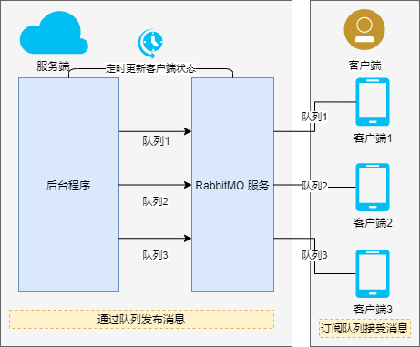

# 设备与服务端消息通讯方法

常用的服务端与设备通讯协议有 `Message Queue Telemetry Transport Protocol (MQTT)`, `Advanced Message Queuing Protocol (AMQP)`, `WebSocket` 等. 其中 `MQTT`, `AMQP` 适用于`物联网场景`, `websocket` 适用于 `HTML 应用`与服务器的双向通讯.

如果使用 HTML 应用作为设备的客户端, 则可以通过 `MQTT over Websocket` 来实现物联网场景的设备, 服务器消息通讯.

由于产品均通过安卓主板启动, 非纯 HTML 产品, 因此最好使用 `AMQP`, `MQTT` 协议作为设备与服务器的消息传输协议.

## 通讯协议说明

`MQTT` 与 `AMQP` 协议的详细对比参考 [MQTT AMQP 比较说明](https://signposs1.oss-cn-shenzhen.aliyuncs.com/docs/StormMQ_WhitePaper_-_A_Comparison_of_AMQP_and_MQTT.pdf).

二者都属于物联网协议, 主要的差距在于:

- MQTT 具有客户端/代理体系结构，而 AMQP 具有客户端或代理以及客户端或服务器体系结构。
- MQTT 遵循发布/订阅的模式，而 AMQP 遵循响应或请求以及发布/订阅的方法。
- AMQP 的标头大小为 8 个字节，MQTT 为 2 个字节。MQTT 的消息大小较小且已定义，而 AMQP 的大小可协商且未定义。
- MQTT 的方法是连接，发布，关闭，订阅和断开连接。AMQP 遵循消费，交付，发布，获取，选择，确认，删除，恢复，拒绝，打开和关闭。
- MQTT 对缓存和代理有部分支持，而 AMQP 提供了全部支持。
- AMQP 和 MQTT 都遵循 TCP 协议，二进制标准和开放源代码队列系统。
- AMQP 提供的安全性是 IPSec，SASL，TLS 或 SSL，而 MQTT 仅提供 TLS 或 SSL 安全标准。AMQP 与 TCP 一起使用 SCTP 进行传输。 OASIS 支持 AMQP 和 MQTT。

## 通讯模式

项目基本通讯模式要求如下表:

| 传输方向       | 传输模式          |
| -------------- | ----------------- |
| 服务端 -> 设备 | AMQP 单向消息传输 |
| 设备 -> 服务端 | API 接口          |

通讯模式示意图如下:



## 设备在线/离线状态判断

设备通过 `AMQP` 协议与服务器进行连接, 使用 `心跳机制` 进行连接状态判断. 即客户端指定心跳检测时长, 服务端定时向客户端发送心跳检测包, 客户端在接受到服务端发送的心跳检测包后, 发送确认心跳包.

特别的, 消息的发布与回执也计算为一次心跳检测.

默认的心跳超时时间为 60s, 发送心跳包的间隔为超时时间的一半, 也就是间隔 30s, [在两次心跳检测超时的情况下, 连接会被断开, 设备会被认为处于离线状态](https://www.rabbitmq.com/heartbeats.html#heartbeats-interval).

实际测试结果为当 `发送心跳包数量 - 确认心跳包数量 > 5` 时, 连接被断开.

实际项目中, 服务端检测设备从在线变为离线需要 `3min`, 从离线变为在线需要 `1min`.

## 流量消耗

设备流量消耗主要分为设备连接, 设备心跳检测, 设备消息接收与回执三个部分.

### 设备连接

设备连接使用 `TCP + SSL` 模式与服务端连接, 每次连接 128KB. 设备连接的流量消耗会出现在应用初始化与设备断线重连后.

### 心跳检测

非 `SSL` 连接下, 设备心跳检测每次心跳上传, 下载流量消耗各 8 bytes, 按照默认值进行计算, 每 30s 间隔完成一次心跳包收发. `心跳流量消耗 = 86400/30*8*2/1024`, 一天消耗约为 45KB.

如果使用 `SSL` 连接, 心跳检测每次上传, 下载流量消耗各 37 bytes. 同上, 一天消耗约为 208.125KB.

如果使用 `安卓 4.4` 的设备, 由于不支持 `TLSV1.2`, 默认被降级为 `TLSV1`, 此时的心跳下载流量会翻倍, 上传流量不变. 此时的一天流量消耗约为 312.1875 KB.

### 设备消息接收与回执

消息接收与回执的流量按照消息的大小进行计算, 不计入默认值的计算中.

### 静默状态一天消耗

按照每天完成一次设备启动, 设备安卓版本 6.0, 使用 `SSL` 加密连接, 默认值的心跳检测, 无任何消息接收与回执进行计算, 静默状态下每天的流量消耗约为 128 + 208.125 = 336.125KB.

## 配置与功能

消息通讯使用 `RabbitMQ` 作为 AMQP 协议的实现依赖, 分服务端配置与客户端配置两个方面, 其中服务端包括`RabbitMQ 运行环境配置`与`运行程序 RabbitMQ 连接配置`.

客户端配置主要为`安卓客户端连接配置`.

### 服务端

#### 运行环境

`RabbitMQ` 运行环境推荐使用 `docker` 容器进行搭建, 建议使用 `management` 带控制面板类型镜像.

配置需要暴露的端口有 `AMQP 协议连接端口` 与 `消息队列管理平台端口`.

需要通过 management 工具新建 `服务端账户` 与 `客户端账户`, 并分配不同权限与 `vhost`.

#### 服务端配置

1. 与 RabbitMQ 服务连接. 服务端与 RabbitMQ 属于同域下不同容器服务, 可以通过 TCP 协议建立连接, 需要指定的配置包括 `host`, `port`, `username`, `password`, `virtual-host`.
1. 与客户端通讯. 服务端与客户端连接使用默认的 `amq.direct` 交换机, 交换机模式为 `direct`. 使用 `设备号` 作为消息队列发布的`队列名称(queue)`和`路由参数(routingKey)`.

#### 主要功能

服务端主要的功能如下:

1. 通过 amqp 协议向指定设备发送消息
1. 定时向 RabbitMQ 服务获取当前消息队列的连接状态, 更新数据库中设备连接状态.

### 客户端

#### 运行环境与依赖

客户端使用 `安卓4.4及以上系统`, 使用 `java amqp-client:4.9.3` 进行开发.

需要注意的是, `android6.0` 及以下版本只能使用 `amqp-client 5.x` 以下版本.

#### 客户端配置

1. 与 RabbitMQ 服务连接. 客户端与 RabbitMQ 服务使用 `TLSV1.2` 建立 SSL 连接, 需要根据服务端提供的私钥创建 `SSLContext`. 需要指定的配置包括 `host`, `port`, `username`, `password`, `virtualHost`, 允许`设备自动重连`且设置自动重连时间间隔. 客户端默认使用的 `心跳超时时长` 为 `60s`.
1. 订阅服务端发布的队列. 客户端使用 `amq.direct` 交换机, 指定 `设备号` 为订阅的`队列名称`和`路由参数`, 订阅的队列需要被持久化(durable=true).
1. 客户端的消息队列无法在主线程被建立, 需要新建线程启动消息队列通道.

#### 主要功能

客户端主要用于接受服务端发来的消息通知, 并根据消息通知完成不同的功能.

## 消息结构

消息队列使用 `JSON` 结构进行信息传输, 消息结构如下:

```js
interface MessageData {
    // 消息类型
    String type;
    // 消息内容
    Object data;
}

```

客户端根据`消息类型`进行不同业务逻辑处理.
