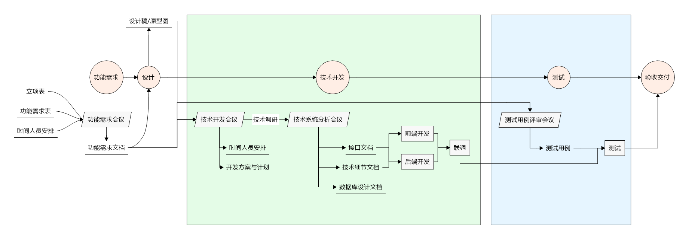
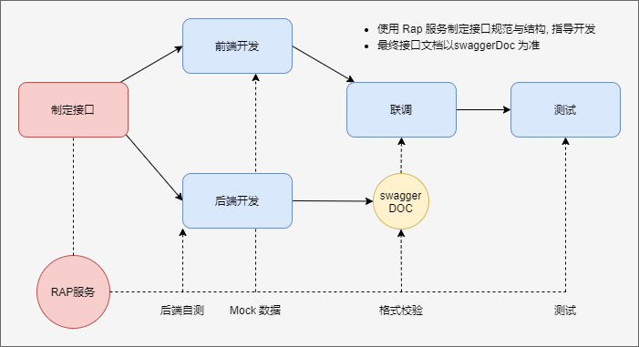

# 技术开发流程规范

技术开发流程位于`功能需求/设计`步骤与`测试交付`步骤之间, 整体的工作流程如下图所示

## 前置需求

技术开发过程依赖于完整的`功能需求文档`与`设计稿/原型图`, 良好的功能需求文档与设计稿/原型图能极大的提升开发效率与沟通效率. 二者在技术会议后整合为`技术细节文档`.

### 功能需求文档

功能需求文档作为所有开发的先决条件, 需要对开发的产品进行系统的需求分析与整理, 对于已经存在的产品, 可通过修改以前的功能需求文档调整至适合当前项目的说明.

功能需求文档需要包含需要开发的`功能模块`与对应`功能说明`, 尽可能详细的描述每个功能点的`使用操作说明`.

功能需求文档**要求**以`思维导图`进行编写与查看分享, 导出为`word 或者 PDF 文件`用于文档存档备份. 推荐使用 `MindManager` 进行功能需求文档的编写, 使用备注功能对模块功能点进行标记, 并分享为 `html` 格式用于后续开发查看.

### 设计稿/原型图

设计稿/原型图是前端开发的基础要求, 任何前端产品的开发都需要对应的设计稿的支持.

对于存在现成开发组件的产品(管理后台), 可通过制作页面原型图用于前端开发; 对于需要完整设计以及需要使用独立样式的产品, 在提供原型图的基础上, 还需要提供完整的设计稿用于前端的样式开发.

设计稿/原型图的制作**要求**使用`Adobe XD`或者`sketch`进行制作, 并上传至`蓝湖`或者`摹客`上用于设计稿资源与样式的分享, 便于前端开发的使用.

## 技术开发

技术开发主要指前后端根据`功能需求文档`与`设计稿/原型图`完成产品功能开发的过程, 此阶段按照开发任务需求分为 1-2 次开发会议.

> 对于较为简单的项目, 可以在功能需求会议完成相应的时间人员安排任务.

一般的, 技术开发会议制定`时间人员安排`与`开发方案与计划`, 在经过技术调研后, 再通过技术系统分析会议确定`接口文档`, `数据库设计文档`, 以及整合功能需求文档, 设计稿为`技术细节文档`用于前后端同步开发.

### 技术开发会议

任何涉及到当前功能产品开发的开发人员均需要参加技术开发会议, 主要目的有 3 个,

1. 了解功能需求, 讨论技术细节文档
1. 针对功能需求提出开发计划
1. 制定人员时间安排

### 技术系统分析会议

在制定开发计划与时间安排后, 技术开发将针对功能需求进行**技术调研**, 并整理详细的`技术细节文档`, 后端开发制定相应的`数据库设计文档`与`接口文档`.

技术系统分析会议会对`技术细节文档`, `接口文档`进行评审, 用于指导后续开发.

#### 技术细节文档

一般的, `技术细节文档`可以在`功能需求文档`上进行细节标注, 用于指导开发. 对于存在较大变化的, 需要重新整理`技术细节文档`.

#### 接口文档

用于同步开发的接口文档的制作要求通过 `RAP 服务` 进行制作, 本地部署的[RAP2 服务](http://192.168.1.228:3000).

后端开发针对每次需要开发的功能模块新建接口仓库, 编写模块, 接口字段与接口数据格式.

前端开发可以查看制定的接口, 并使用 `mock` 方法制作假数据用于与后台进行同步开发.

待后端开发完成后, 将会通过代码生成`swagger doc`用于正式的接口文档与测试, 后端开发应尽可能保证制作的`接口文档`与生成的`swagger doc`结构, 数据保持一致. 如有修改, 应预先告知前端开发.

:::warning 注意
最终所有接口文档以代码生成的`swagger doc`为准, `RAP 服务`仅用于前期指导开发与格式校验
:::

## 测试

测试需要根据`功能需求文档`与`设计稿/原型图`完成`测试用例`的编写, 需要涵盖各模块, 各功能点的测试条件, 操作步骤, 预期结果等部分.

对于正式项目, 完成测试用例编写后, 需要召开`测试用例评审会议`, 项目各组成员均需参加讨论并提出修改意见, 并签字确认.

技术开发步骤完成后, 功能产品需要按照测试用例进行逐项测试, 并作为交付验收的标准.
