# 钉钉项目管理文档说明

## 项目管理入口

PC 端入口---钉钉主页---代办---项目

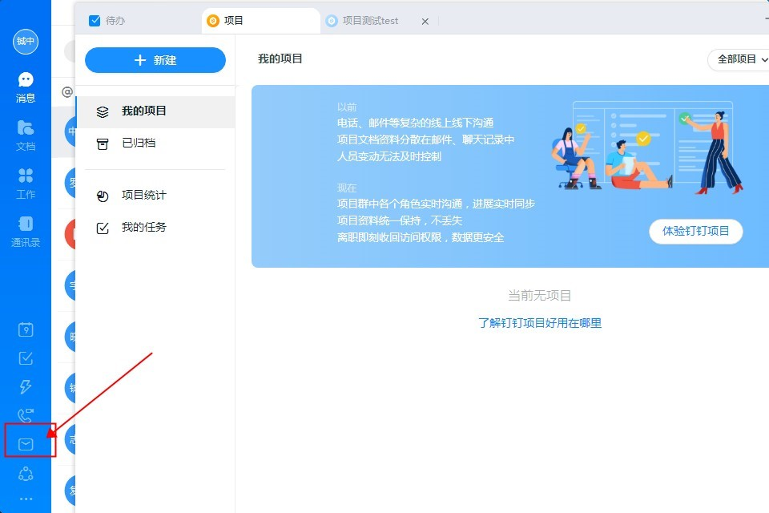

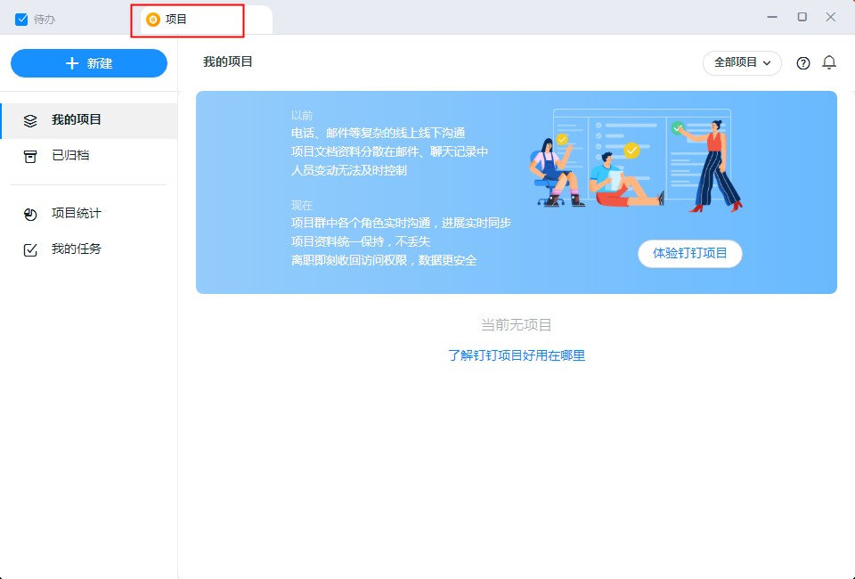

手机端入口---通讯录---项目

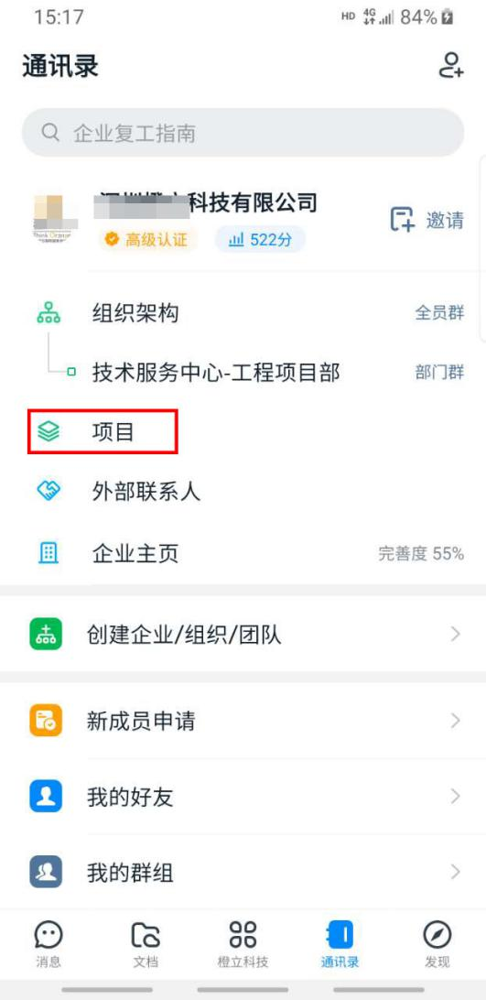

## 新建项目

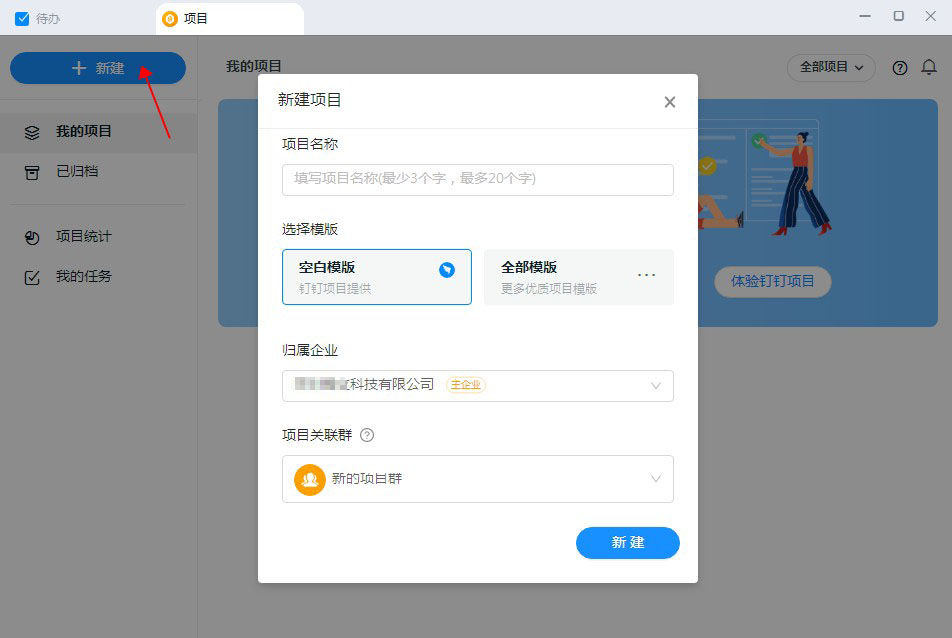

按相应的提示填写创建项目，选择空白模板。（ps：项目相关群先不用选择，等建好之后可以添加项目相关成员

## 添加项目相关成员

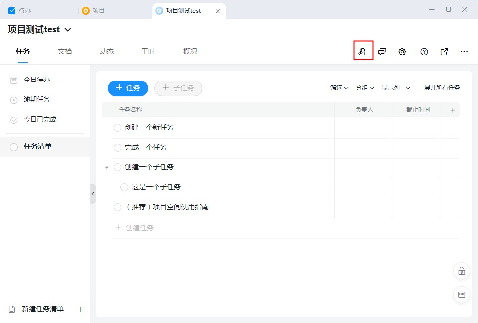

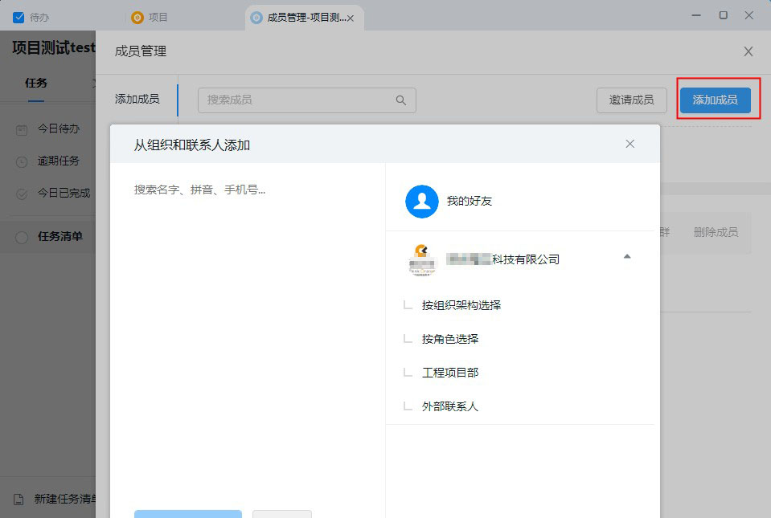

添加完成后会自动生成项目交流群

## 创建新任务

1. 点击 “+任务” 添加点击
2. 选中一个任务，输入回车快速添加
3. 点击 “+新建任务”

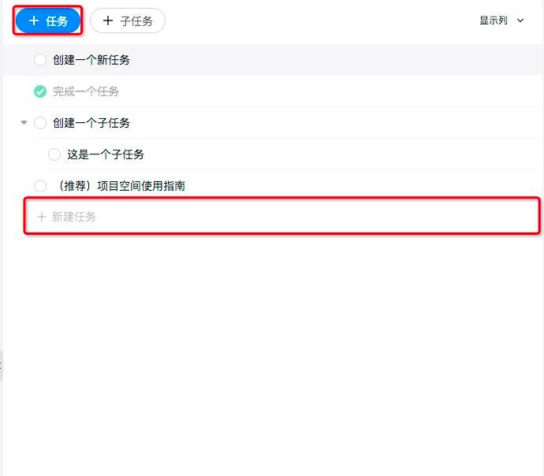

设置负责人时间优先级参与人等

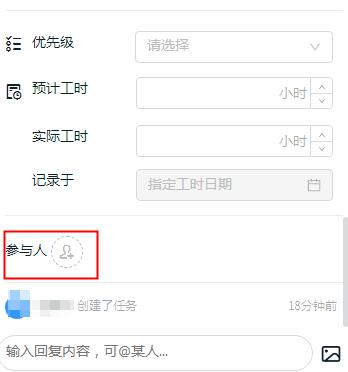

## 创建一个子任务

1. 选择一个任务，再点击 “+子任务” 便可在该事件下添加子任务
   
2. 使用快捷键 tab，将一个任务设置为上一个任务的子任务，最多支持 3 级任务。使用 shift+tab 将一个子任务移出父任务
3. 通过将一个任务拖拽到另一个任务上，可以设置为子任务
   

## 今日代办事项、逾期事项、任务清单等查询

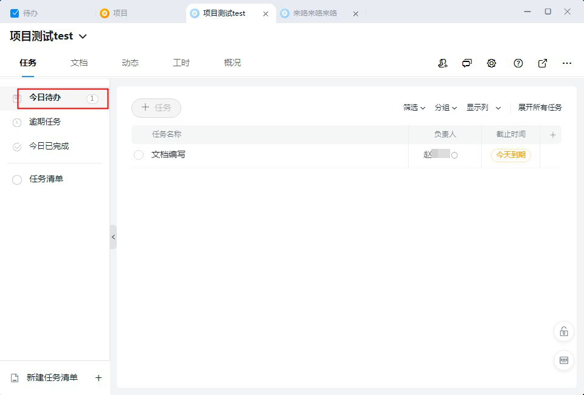

## 项目文档

点击文档---新建知识文本，分类上传或者编写相应的项目资料或者文档或者导入本地资料
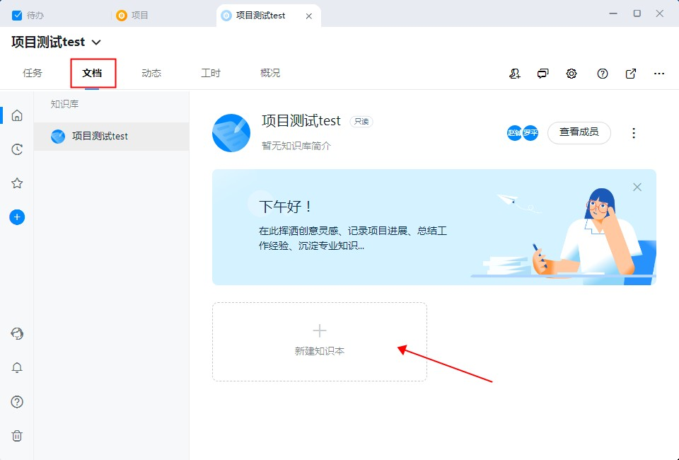

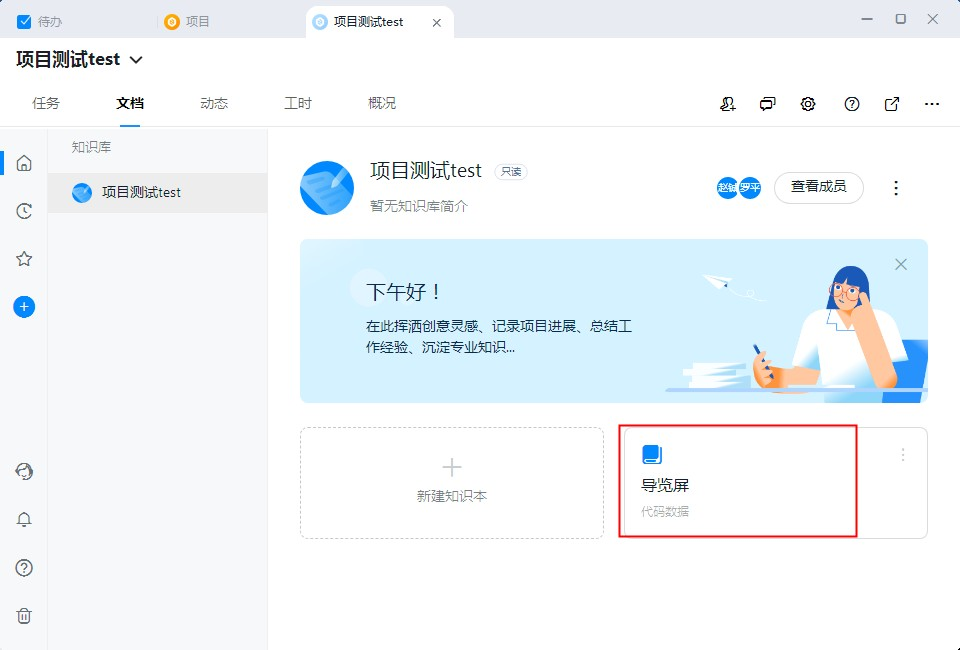

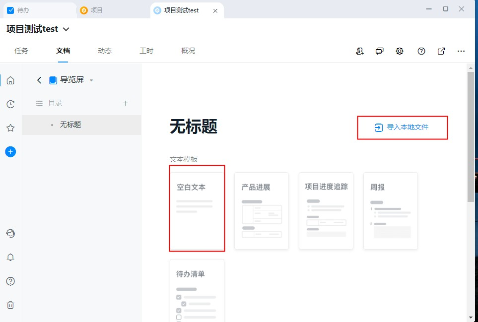
