# 钉钉任务管理使用说明

**首先确保你的钉钉已升级至最新 5.0 版本.**

公司使用钉钉`待办`功能实现任务发放与管理.

## 操作说明

操作说明引自[钉钉待办官方说明文档](https://thoughts.teambition.com/sharespace/5e3971dc7f9dc5001a28b728/docs/5e3971dc7f9dc5001a28b727)

### 待办入口

#### PC 端入口

在 PC 端钉钉首页左侧导航栏找到「待办」按钮, 点击进入即可.

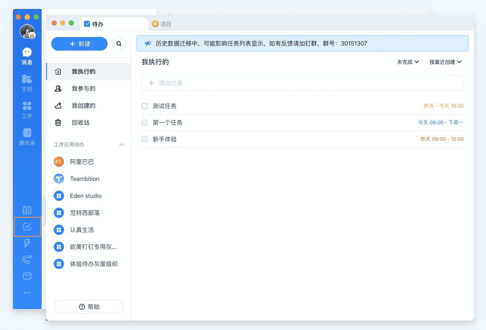

#### 移动端入口

在移动端钉钉首页上方快捷栏找到「待办」按钮, 点击进入即可.

### 创建任务

#### PC 端

1. 在待办首页点击左上角「 + 新建 」, 填写任务标题、执行人、截止时间, 点击「完成」即可快速创建任务；也可点击「更多」展开填写更多任务信息, 完成一条任务的创建.

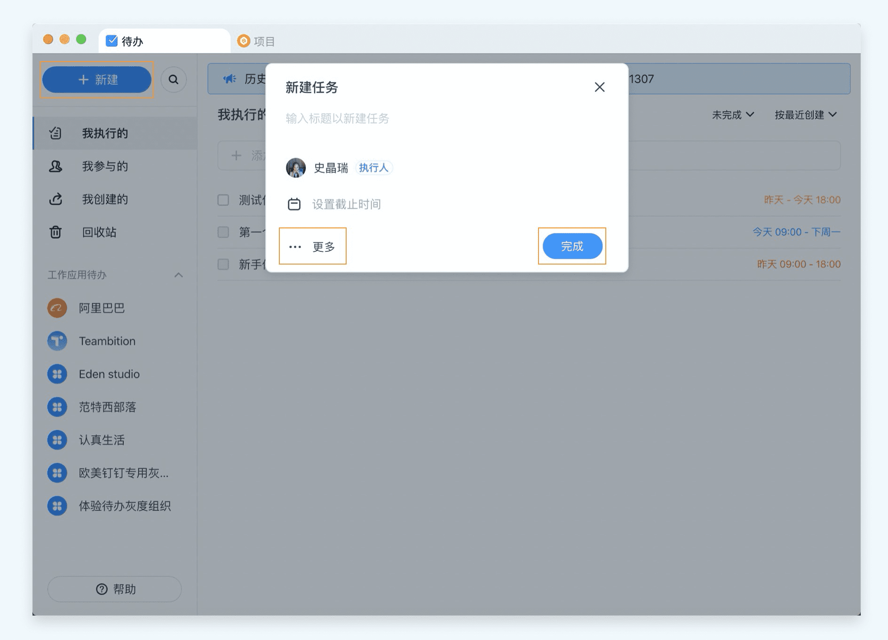

2. 在待办首页的 「快速输入框」中, 直接输入任务标题, 按下回车即可快速创建一条任务.

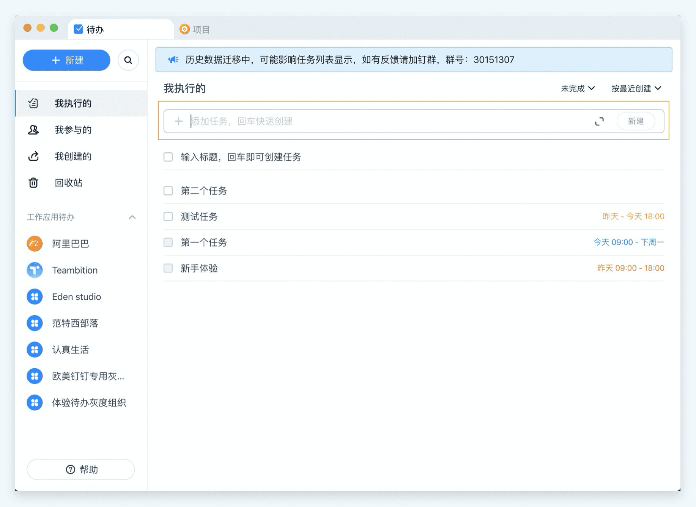

#### 移动端

在待办首页点击右下角「+」, 填写任务标题、执行人、截止时间, 点击「创建」即可快速创建任务；也可点击「更多字段」展开填写更多任务信息, 完成一条任务的创建.

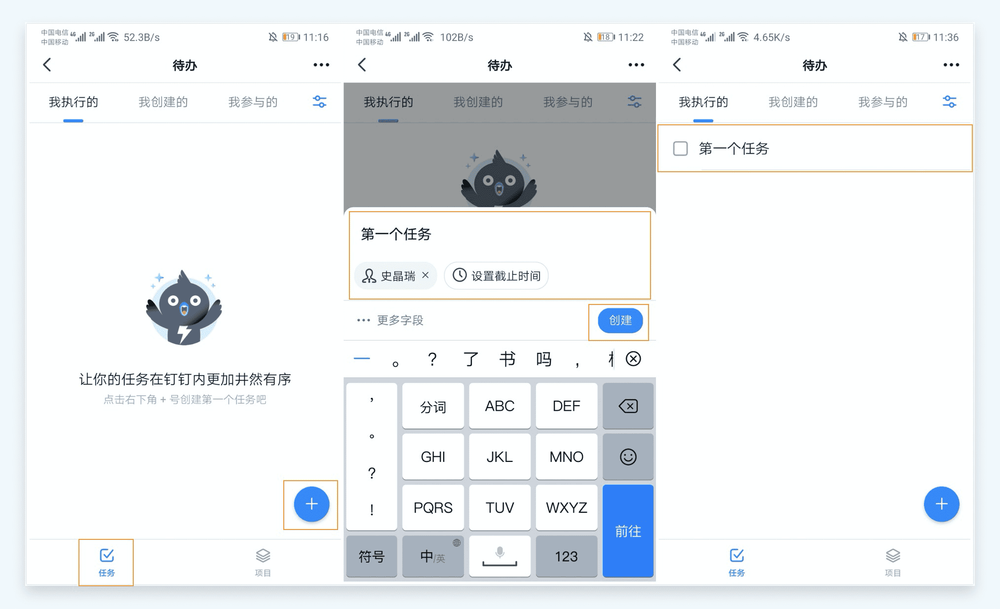

### 任务多人派发

在任务详情页, 勾选「将任务指派给多人」, 即可同时选择多个执行人, 一键完成任务多人派发. 开启「单聊通知执行人」, 对应任务执行人即可通过钉钉单聊收到此条任务提醒.

#### PC 端

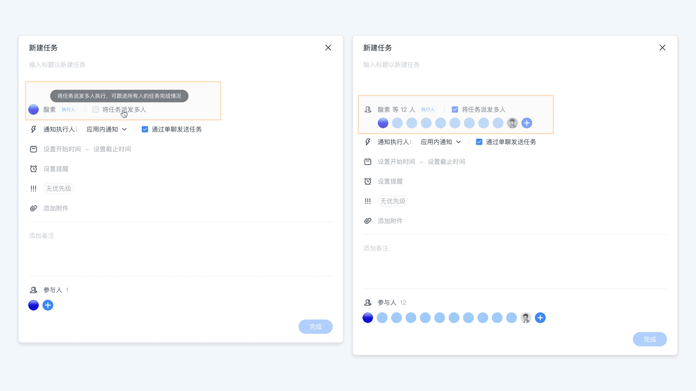

#### 移动端

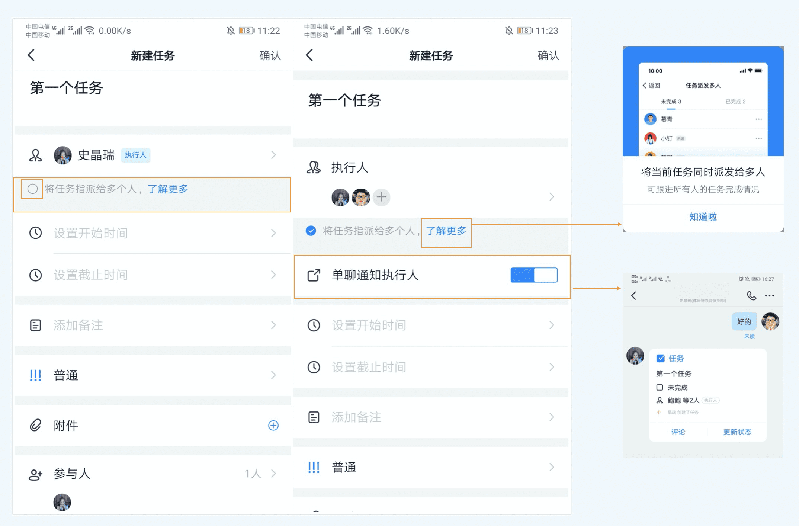

## 任务发放

### 新建任务

快速创建任务见 [创建任务](#创建任务).

一般的, 新建任务需要完成如下必须设置

- 任务名称
- 指定执行人
- 设置截止时间

如有特殊要求, 点开`更多`填写其他任务信息.

### 指定执行人

一般情况下, 指定一名执行人作为任务的接收者. 当任务任务分配给多人时, 参考 [任务多人派发](#任务多人派发)

### 设置截止时间

截止时间一般以`天`为基本单位, 只选择完成的日期.

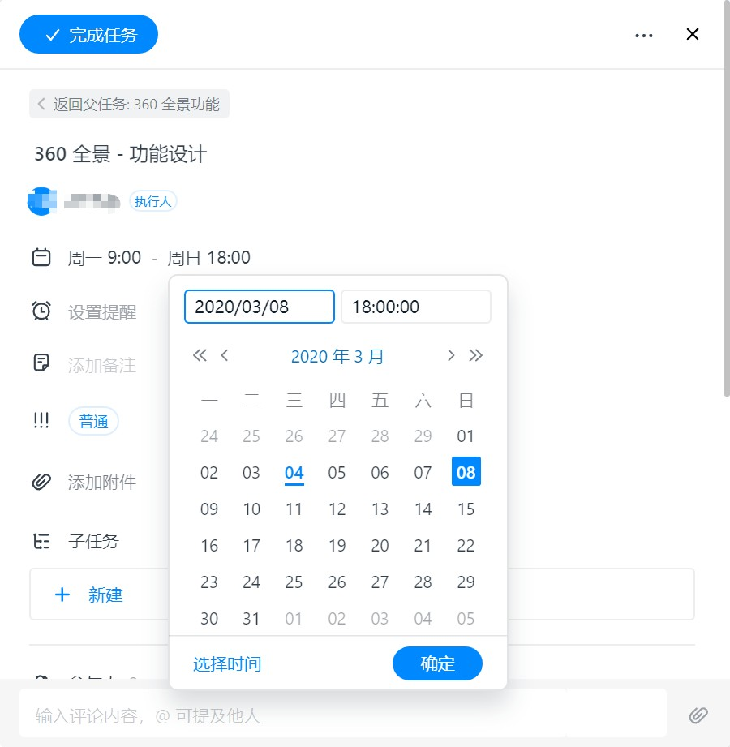

对于紧急项目, 以`小时`为单位, 指定具体的完成时间.

### 设置优先级

默认优先级为`普通`, 优先级设置请根据任务紧急程度判断.

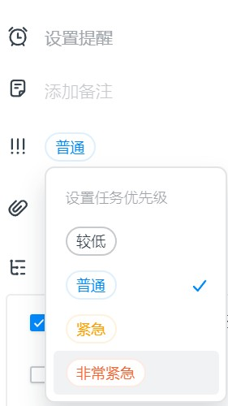

### 填写备注

对于任务名称就能说明的问题, 可不必填写任务备注.

任务备注主要用于补充说明任务的要求, 包括

- 任务的完成形式
- 外部联系人
- 参考链接

更多的细节(文字多于 300 字)要求需要通过[上传附件](#上传附件)完成.

### 上传附件

尽可能的 **不** 上传任何附件(_图片除外_), 任务细节不多的情况下(通常少于 300 字), 通过 [任务备注](#填写备注) 的形式完成.

### 添加参与人

对于参与此任务的人员, 或者上下游对接的人员, 可以将其加入`参与人`便于接受通知提示.

::: tip 特别注意
任何任务的`修改与答复`钉钉都会发送提示消息给所有`参与人`, 对于需要接受任务提醒的注意增加参与人.
:::

### 添加子任务

对于需要将任务分解的情况, 使用添加子任务的方式分解任务, 并分配给不同的执行人.

::: tip 提示
子任务可以用做`任务计划安排`, 添加子任务发送给自己, 可以更有效的对工作进行管理.
:::

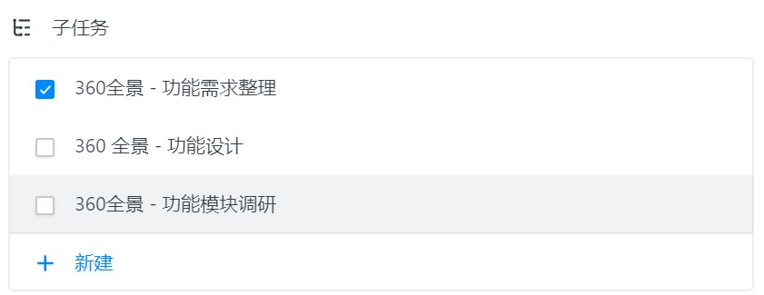

在子任务菜单头, 可以查看返回父任务, 以便于查看其他分解的同级任务菜单.

## 任务评论与答复

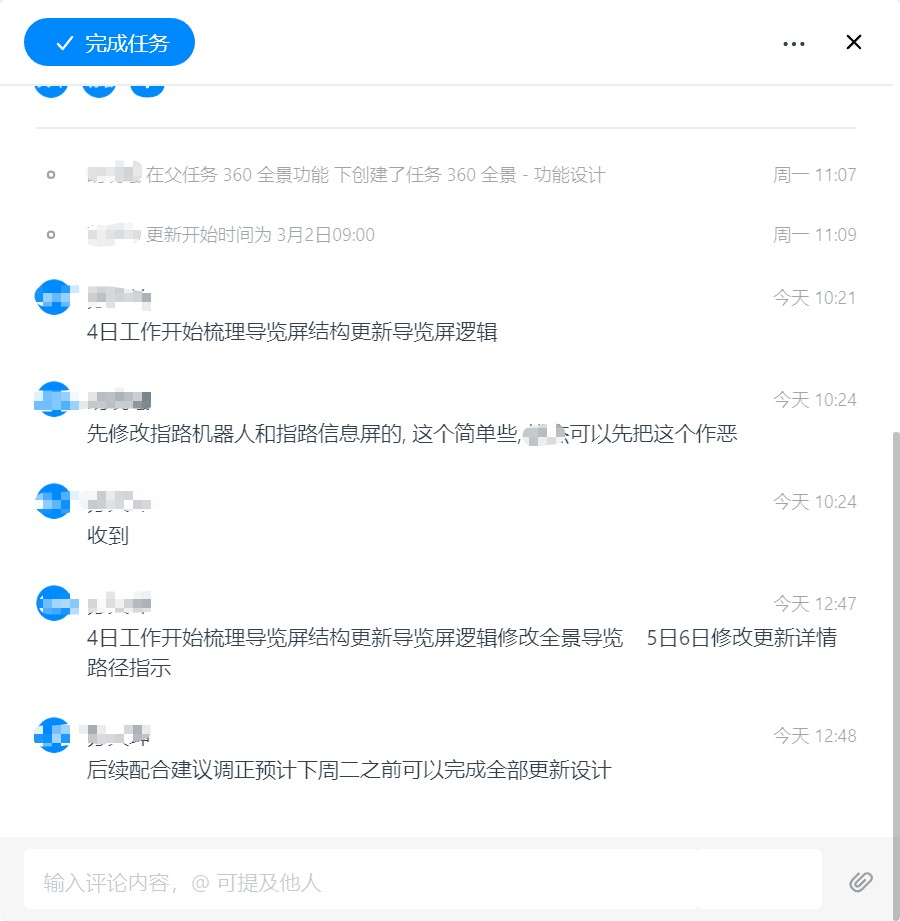

任何任务完成时必须提供评论与答复, 一般评论包括任务 _计划答复_, _完成答复_, _变更答复_ 三种类型.

### 任务计划答复

接到发放任务后, 对于任务工作较为复杂的, 或者任务备注中明确要求需要提供任务计划的, 可在评论中对任务进行分解, 或者通过 [子任务](#添加子任务) 完成任务计划.

### 任务完成答复

任务完成后需要点击`完成任务`按钮完成任务, 并在评论中做简要描述, 如上传完成的图片或链接.

### 任务变更答复

由于已完成的任务新增评论时不会发送提醒, 在有任务需要变更时, 点击灰色的`已完成`图标至蓝色`完成任务`图标, 再做评论更新. 待变更后的任务完成后再关闭任务.

## 任务列表

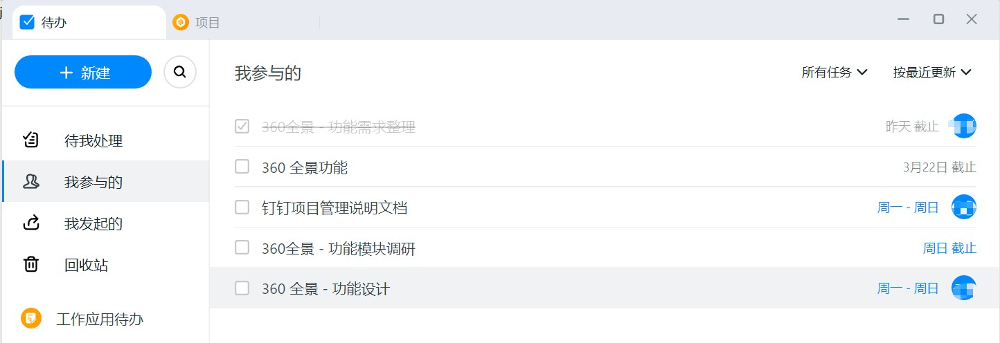

### 我的任务

此分类下只包含自己作为`任务执行人`的任务, 此分类下的任务需要重点关注.

### 我参与的任务

此分类下显示自己作为`参与人`的任务, 这些任务会在`修改`或者`答复`时收到系统提醒.

### 我发起的任务

此分类下显示自己发出给其他人的任务, 包括自己发给自己的任务.
