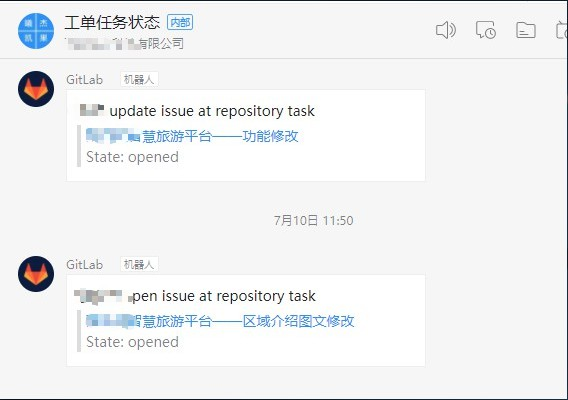

# GitLab 工单管理使用说明

GitLab 是一个代码托管平台, 通常用于代码版本管理以及问题反馈, 公司使用 GitLab 用作代码仓库与工单管理.

## GitLab 地址

`https://gitlab.com/signp`

- 如果还未注册 GitLab 账号, 请注册并登录 GitLab 后刷新再试
- 注册后将邮箱发给管理员, 加入项目组
- 以上两步均无问题但无法正常显示项目组信息时, 请与管理员联系

注册 gitlab 账号后, 在用户设置中修改个人头像和名称, 以便于自己和项目组成员区分. 账号使用`名字拼音`, 名称使用汉字填入

## GitLab 工单管理

所有项目的工单均使用 [task 项目](https://gitlab.com/signp/task/issues) 进行发放.

### 工单列表

在项目列表页面左侧菜单栏点击 `issues`(议题), 显示项目中还未完成的工单, 如下图所示

### 工单看板

点击 `issues` 下属的 `Boards`(看板), 以展板形式显示所有项目中的工单状况

可以通过鼠标拖拽更改工单状态

### 工单处理

#### 工单状态

一般的, 工单分为 4 种状态

- `Open`(打开的)
- `To Do`(要做)
- `Doing`(在做)
- `Closed`(关闭的)

#### 工单发放

所有发放的工单都会放置在 `Open`(打开的)或者`To Do`(要做) 列表下, 工单右下角会有分配的人员头像提示.

#### 工单接受

将 Open 列表下面的工单拖拽至 `Doing`(在做) 列表下, 此时工单表示已被接受且正在进行中.

#### 工单完成

将对应工单拖拽至 `Closed`(关闭的) 列表, 此时工单将被关闭.

### 工单新建

所有项目组成员均可发放工单, 新建工单需要注意选择 `task` 项目

点击 Issues 按钮, 新建工单

新建工单时需要明确

- `Title`: 标题, 需要包括项目名称, 需要完成的内容
- `Description`: 内容, 详细的内容说明
- `Assignee`: 分配人, 指定工单的完成者, 只能选择一个
- `Due data`: 完成时间
- `Labels`: 标签, 一般不选择或者选择 `To Do` 标签

### 工单编辑

工单编辑主要有以下内容

- 修改主题内容
- 工单评论
- 修改完成人
- 修改状态

::: tip 特别注意
完成, 关闭工单时必须提交评论并提供可测试地址或文件
:::

## 工单提醒

钉钉群 - 工单任务状态已添加 gitlab 机器人用于工单提醒, 请注意查看与接收工单任务

