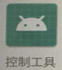
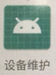
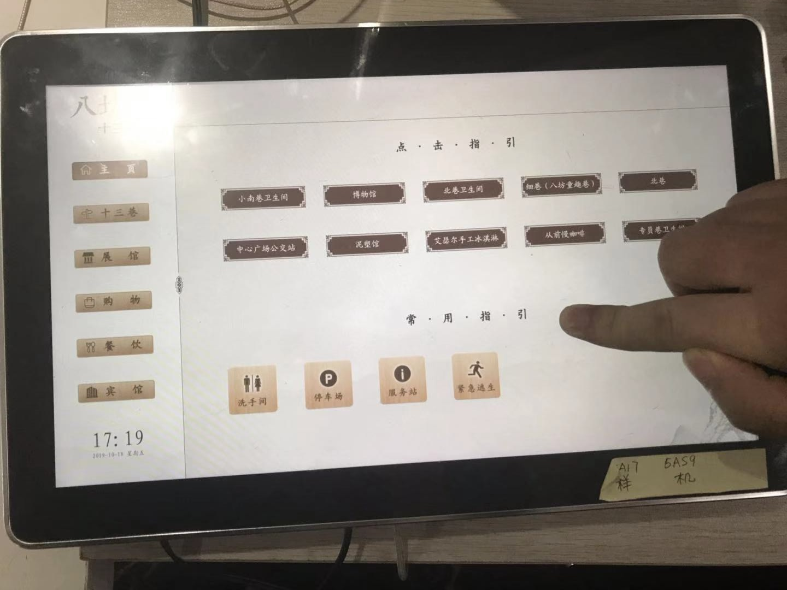
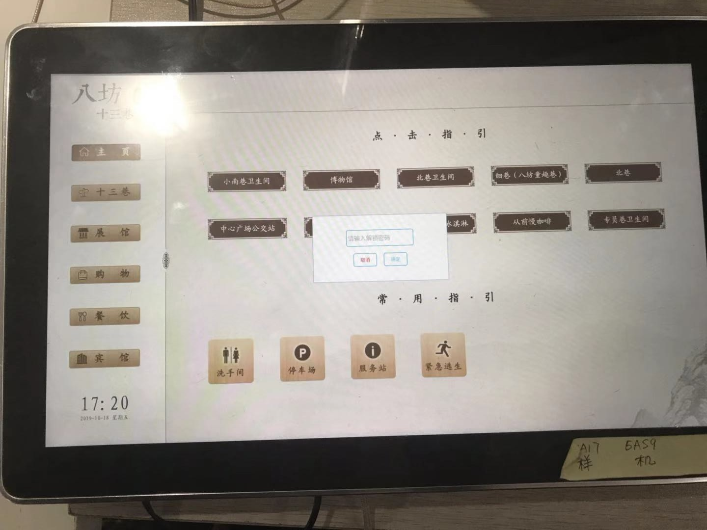
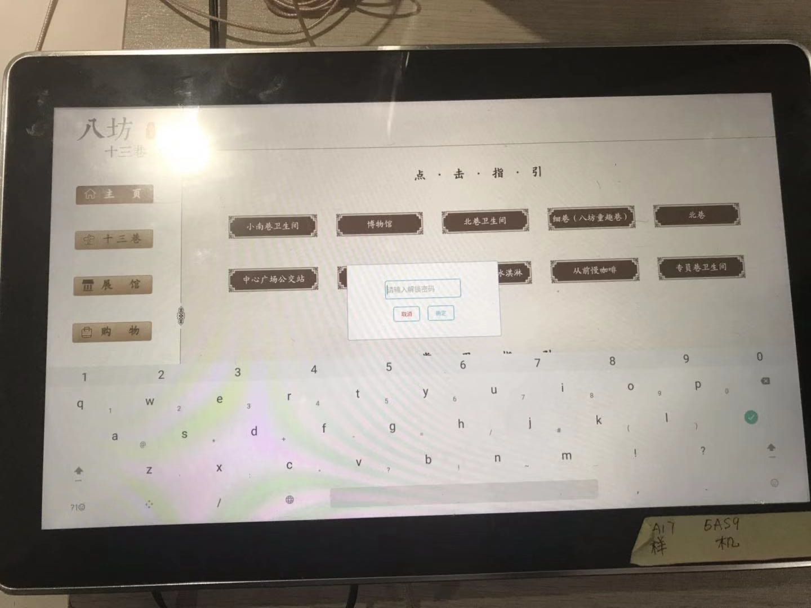
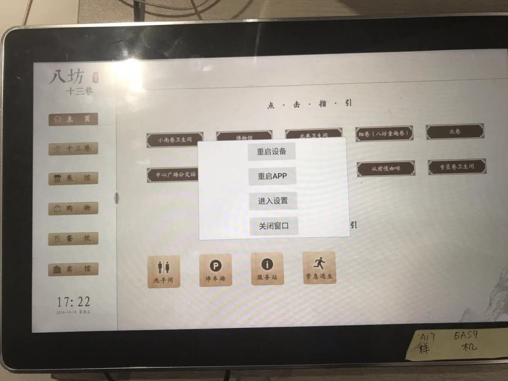
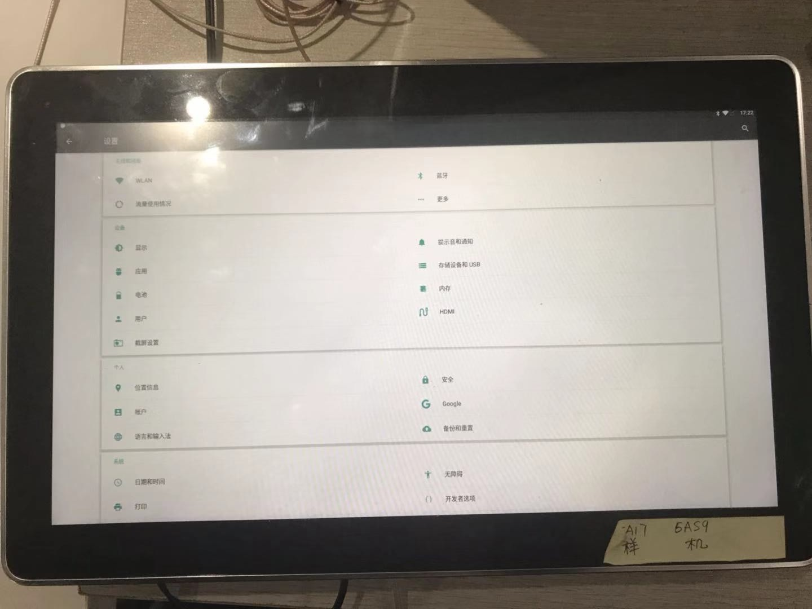

# 指路机器人维护

## 指路机器人与维护相关 APP

指路机器人与其维护相关的 APP 有三个, 其中安卓屏上 2 个, 管理员手机 1 个

### 设备 APP

1.  指路机器人标准版

此 APP 为程序运行主 APP, 由产品出厂内置, 可远程升级.

2. 控制工具

控制工具用于后台与服务器通讯, 进行控制指令的下发. 需要产品出厂内置, 可远程升级.

能够在有网络情况下, 远程对屏进行重启和进入设置, 以方便维护.

### 用户管理 APP

设备维护 APP 需要由管理员用户手机安装, 用于调试与配置硬件设备.

在没有网络情况下, 屏也无法点击, 需要对屏进行解锁时, 可以通过手机安装设备维护软件, 进入设备维护软件, 然后去开启手机的热点, 把热点的名称改为 `CLKJ` 密码改为 `cl87654321`, 等待屏与手机的连接, 连接成功后, 可以点击重启和进入设置对屏进行相关的操作.

## 故障与问题列表

| 问题场景                       | 原因                                                                           | 解决方法                                                                                                                                                                                        |
| ------------------------------ | ------------------------------------------------------------------------------ | ----------------------------------------------------------------------------------------------------------------------------------------------------------------------------------------------- |
| 屏幕黑屏                       | 设备的电源线, 屏线可能接触不良, 以及电源是否接通                               | 检查设备电源是否接通, 以及设备的电源线, 屏线是否接触良好                                                                                                                                        |
| 屏幕上显示基础资源不合法(白屏) | 这种情况是由于最新运行资源没有下载完成, 也没有本地运行资源, 很大情况是没有网络 | 检查 4g 卡是否接入正确且没有弹出, 设备天线是否安装正确位置, 网络无问题后, 杀死 app, 重新进入一次即可                                                                                            |
| 最新资源文件无法正确更新       | 旧文件删除失败了                                                               | (1)进入设备的资源管理器,在根目录下找到 TODirection 的文件夹, 长按文件夹, 后点击删除(2)点击设置->应用->指路机器人标准版->存储空间 点击清除数据和清除缓存(3)检查网络后, 杀死 app,重新进入一次即可 |
| 可触摸屏幕无法点击             | (1)触控线接触不良(2)屏幕可能坏了(3)app 崩溃了或者 app 内存不够了               | (1)断电重启下屏, 看是否以及解决(2)检查屏的触控线是否接触良好                                                                                                                                    |
| app 一直重启                   | app 运行出现问题, 请及时拍下出现问题的视频, 及时在项目群里反馈                 | app 升级维护                                                                                                                                                                                    |

## 维护方式

### 在正常显示页面进行屏解锁

前置要求：`可触摸屏，主程序未崩溃`。

1.  长按屏幕 8 秒, 然后在 1 秒内快速点击 3 次屏幕

点击后

2.  输入密码 `cl87654321`

输入后

可以重启 app 和重启设备也可以进入`设置页面`

### 通过手机控制屏进入设置或者重启

前置要求：`非触摸屏，与主程序是否崩溃无关`。

在无法操作屏或者非触摸屏的情况下, 可以通过用户手机进行控制管理, 此功能在主程序崩溃(通常为程序无响应)时依然有效.

1. 首先需要一台能开热点的 `android手机`
2. 该手机安装`手机端维护app`, 并打开, 授予相关权限
3. 开启手机热点, 热点的密码和名称需要修改为`CLKJ`和密码`cl87654321`
4. 如果设备连接指定热点后, 可以通过手机端维护 app 对设备进行控制
5. 点击手机端维护 app 主页面中的`进入设置按钮`即可控制设备进入设置页面
6. 点击手机端维护 app 主页面中的`重启设备按钮`即可控制设备重启

### 远程控制设备重启或者进入设置页

迁至要求：`网络正常, 与主程序是否崩溃无关`。

在`网络正常`的情况下, 可通过设备管理后台直接对硬件设备进行重启与进入设置页的操作. 此功能在主程序崩溃(通常为程序无响应)时依然有效.
