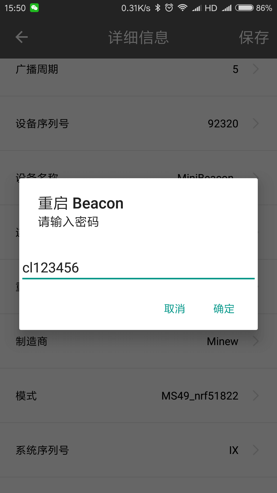

# ibeacon 配置

## 配置简易说明

### 使用工具

- [console 后台页面](https://console.signp.cn/)
- [安卓手机与 BeaconSET 软件](https://shouji.baidu.com/software/8058012.html)

### 操作流程

#### 通用流程

```
蓝牙分组(后台) → 微信蓝牙设备申请(后台) → 蓝牙列表查看(后台) → APP 中 ibeacon 写入(手机) → 蓝牙绑定(后台)
```

## 蓝牙分组

`设备管理-蓝牙分组`

1. 对于没有生成蓝牙分组的项目, 需要生成蓝牙分组, 以便于根据项目进行管理对应的蓝牙, 初始状态如下图


2. 输入分组名称, 点击添加分组


3. 生成的分组列表如下


## 微信蓝牙设备生成

`设备管理-微信蓝牙设备 ID 申请`

生成蓝牙分组后, 需要在对应分组里向微信请求蓝牙编号, 以便于微信的蓝牙接口进行搜索

1. 选择对应项目与分组, 申请微信蓝牙编号, 通常数量按照所需蓝牙数量生成


2. 点击提交, 此时会缓存一个向微信公众号发起蓝牙编号申请的请求, 点击 process 处理当前请求


3. 完成后会看到对应已处理的项目与分类列表


## 查看项目蓝牙列表

`设备管理-蓝牙列表`

可以看到对应项目中生成了未绑定的新生成的蓝牙编号值, 需要完成的就是将 major, minor 写入对应的 ibeacon 设备中


## 蓝牙参数写入

`app(BeaconSET)`

1. 打开手机蓝牙与需要写入的 ibeacon 设备


2. 进入 beaconSET 应用, 按距离进行排序


3. 点击最近的蓝牙设备, 进入详细信息页

4. 编辑 MAJOR 与 MINOR


5. 设置重启密码 cl123456 (如果已完成, 则不需进行此操作)


6. 点击保存, 输入重启密码(初始密码: minew123, 设置后的重启密码: cl123456)



7. 检查距离最近的设备的 major 与 minor 值是否已经完成修改

## ibeacon 设备绑定

`设备管理-蓝牙列表-绑定`

设备绑定分为 `绑定至点位` 与 `绑定至设备` 两种方式.

### 绑定至点位

1. 选择需要绑定的地图与点位, 此数据必须与图形部门沟通


2. 设置设备的扫描接受强度 RSSI, 默认值为-75, 数值越小, 搜索半径越小


一般的, -59 为 1m 检索半径, -70 为 2m 检索半径, -75 为 5m 检索半径. 由于手机蓝牙芯片不同, 此数值仅供参考

3. 提交点位绑定

### 绑定至设备

1. 在设备列表中搜索对应的设备编号


2. 设置 RSSI 值

3. 提交
