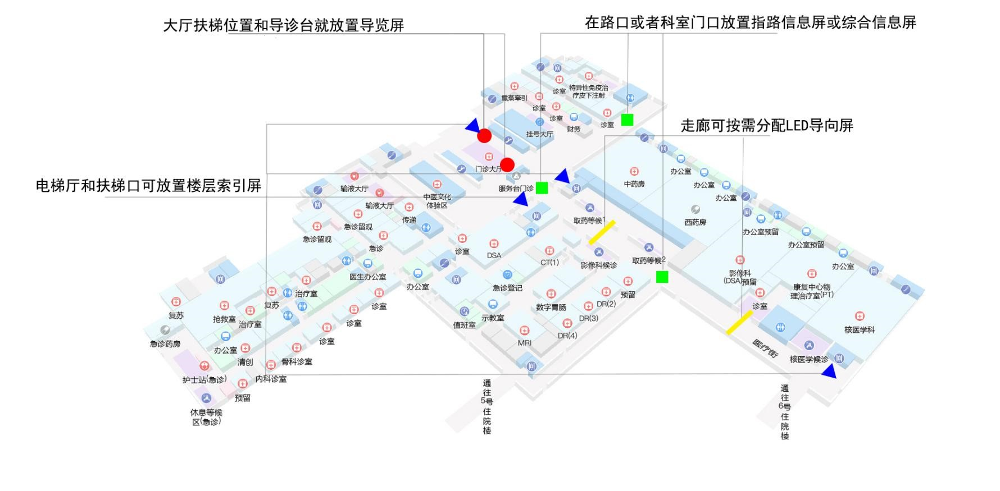

# 产品说明

## 产品类型

设备根据功能区分为`互动指路屏`、`互动导览屏`、`楼层索引屏`、`互动导向屏`、`导向信息屏`、`动态导向屏`、`LED 导向屏`，屏分横竖两种模式。

需要注意的是设备需要指定设备类型，特别注意的是屏的`横纵方向`以及屏的`放置位置`，这两个参数决定了设备安装能否正常使用。

## 产品推荐尺寸与放置位置

| 产品       | 功能                                                           | 推荐尺寸      | 方向      | 推荐位置                                                             |
| ---------- | -------------------------------------------------------------- | ------------- | --------- | -------------------------------------------------------------------- |
| 互动指路屏 | 选择目的地科室以及公共设施，快速指引客户正确行进方向           | 21.5 寸       | 横版      | 电梯入口、人行流线转折点                                             |
| 互动导览屏 | 导向，指导功能，能看当前层或其它层的地图。                     | 32 寸以上     | 横版/竖版 | 大厅扶梯位置或者导诊台处                                             |
| 楼层索引屏 | 指引该建筑物及该楼层的科室信息。                               | 32 寸电视以上 | 竖版      | 楼层电梯入口、大厅入口处。                                           |
| 互动导向屏 | 引导所指引者找到所需求的场所，能够选择目的地科室以及公共设施。 | 32 寸         | 横版      | 人行流线的转折点、分叉点、交汇点等容易引起行人对人行路线疑惑的位置。 |
| 导向信息屏 | 引导所指引者找到所需求的场所。                                 | 30 寸电视     | 横版      | 行流线的转折点、分叉点、交汇点等容易引起行人对人行路线疑惑的位置。   |
| LED 导向屏 | 悬挂方式的导向牌，导向智能化。                                 | --            | --        | 连续通道范围内、 人行流线转折点等。                                  |

推荐的放置位置图如下

## 技术服务支持

公司对设备产品提供硬件与软件两方面的服务支持。

### 软件支持

对于设备安装过程中需要进行软件的安装，资源包的推送以及点位绑定等操作，均由`技术部门`提供软件支持。

- 软件安装
- 资源更新
- 后台设备绑定

### 硬件支持

对于设备安装方式，稳定性及适用性等参数，由`售后服务部门`提供硬件支持，包括硬件设备的稳定使用，物联网卡的网络设置以及屏幕的正常显示。

- 设备安装
- 稳定配置
- 安装规范
- 硬件支持
- 屏幕
- 主板
- 网卡
