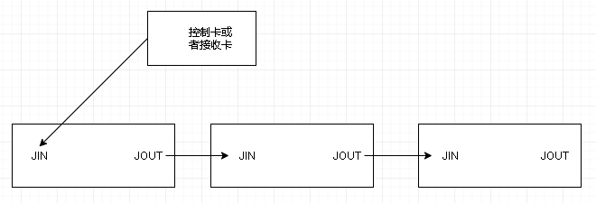

# LED 问题以及维护

## 硬件介绍

### 控制卡

目前控制卡有 2 种选择 `e26`和 `e60`, `e26` 支持的最大长度为 512 像素, `e60` 支持最大长度为 1280 像素

### 接收卡

需要配合 `e60`控制卡使用

## LED 配套软件

`EasyBoard`

1. 配置 LED 网络
2. LED app 升级
3. `e26`的显示参数配置

[EasyBoard 说明书](https://ledok.cn/download/EasyBoard%E8%AF%B4%E6%98%8E%E4%B9%A6.pdf)

`LED Set3.0`

配置 `e60`的显示参数

[LED Set3.0 说明书](https://ledok.cn/download/LedSet3.0%E8%AF%B4%E6%98%8E%E4%B9%A6.pdf)

`注意:LED设备使用前需要联系厂家进行LED显示参数的调试工作`

## 常见问题解答

### 控制卡模组接收卡的走线问题

模组后面的有 2 个方向, 正对模组方向为向上向左 2 个方向就行, 排线合理安排长度, 由 `JP1往模组的JIN接入,后面依次是 JPN往模组的JIN接入就好`, 对于要串联的模组来讲, `由接了JIN的那快模组开始, 找到这个模组的JOUT位置接入你要串联的模组的JIN位置即可`

在接线时, 需要注意模组方向, 电源和排线要合理设计线路, 避免短路情况

### LED 显示模糊如何处理

这个情况有几种原因

1. 字体太小或者其他字体的兼容问题, 导致显示文字时的不清晰, 需要调整字体包, 或者增大文字大小
2. 系统灰度参数需要重新设置, 这个调整时需要和厂家沟通, `e60在调整灰度时, 可能会改变原有的显示参数, 需要联系厂家进行调整`

### LED 个别地方出现了其他颜色, 比如紫色和绿色

这个情况, 很可能是 LED 灯坏了一部分, 还有就是里面的排线被折叠压住了, 导致部分显示信号有问题

`低处放置的LED设备, 最好增加防护面板, 保护LED灯`

### LED 网络问题

这个情况比较复杂, 主要有以下原因

1. LED 拨码无论在 AP 还是在 IC 位置都有 AP 热点, 没法连接 4G 和 WIFI 网络, 该问题, 可以直接返厂维修
2. LED 无法发现 AP 网络, 导致 app 无法更新情况, 使用手机开启名称叫做 `xixun` 密码为 `0123456789`的 WiFi, 电脑连接该网络, 使用 `EasyBoard`的 `一键找卡`, 然后点 `刷新`, 看是否能够找到该设备, 如果找不到也返厂维修
3. 需要使用 WiFi 网络是需要拨码到 WiFi 位置, 并且在 `EasyBoard`的网络设置里面已经设置已经扫描到的 WiFi

`注意 控制卡上的蓝色的等是网络信号等,均匀的闪代表有网络连接`

### LED 启动失败, 显示路径数据获取失败?

本地路径数据解析失败了, 后续会进行优化修改, 原因是数据由于很大采用的文件的部分解析方式, 可能会解析失败, 后续考虑使用其他类型来进行全部解析

### LED 启动时有其他文字广告?

`这个是厂家制作的开机动画一样的东西, 在采购时特别需要说明下不要这个文字, 默认启动是一个蓝色背景`
