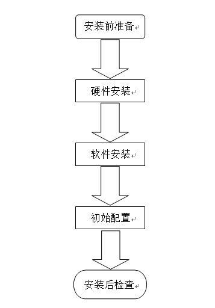
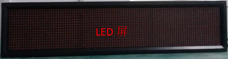
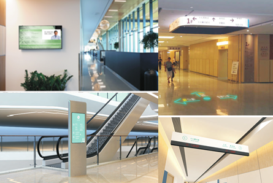
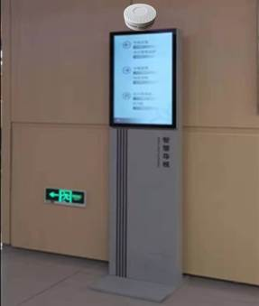
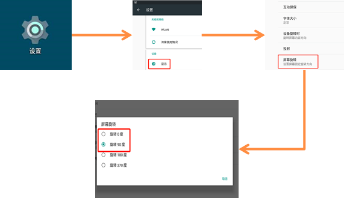
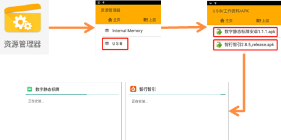
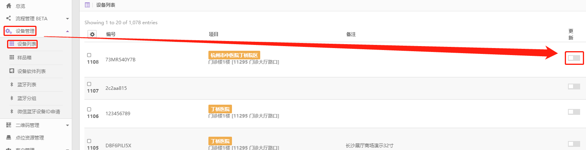

# 智慧标识系统安装维护手册

## 安装流程

## 安装前准备

### 安装环境确认

1. 确认设备布置点位。
1. 确认设备布置点位有供设备使用的外部电源（AC 220V）。
1. 确认设备布置点位运营商无线物联网网络信号良好。

### 基础数据准备

与数据工程师确认地图数据已完成采集，制作，上传。

### 物料检查

- 智能触控／非触控安卓设备（液晶屏、投影仪、LED 屏）。
  
  
  
- 电源适配器
  
- 物联网卡
  
- 蓝牙定位设备（iBeacon）
  

### APK 文件准备

| 序号 | 产品                                                                                               | APK              | 文件名            | 备注                                 |
| ---- | -------------------------------------------------------------------------------------------------- | ---------------- | ----------------- | ------------------------------------ |
| １   | 互动导览屏、互动指路屏、互动导向屏、楼层索引屏、导向信息屏、动态导向屏、LED 导向屏、动态导向投影仪 | 数字静态标牌安卓 | 1.1.1.apk         | 同一安装包，通过后台设置区分产品类型 |
| ２   | 静态数字标牌                                                                                       | 智行智引         | 2.8.5_release.apk |

## 硬件安装

### 设备固定

除 LED 导向屏、动态导向投影仪采用吊挂安装外，其余产品均视情况选择立式、壁挂、嵌入墙体等方式安装。

### 配件安装

- 安装物联网卡
  将物联网卡插入设备卡槽。
- 布置蓝牙定位设备（iBeacon）
  将蓝牙定位设备和安卓设备布置在一起。
  

### 设备连线

设备经电源适配器连接外部电源。

## 软件安装

详细安装说明见[智慧标识软件安装调试](../installation/)

### 安装前设置（液晶屏）

根据终端屏幕使用需要，设置屏幕旋转角度（即横屏显示或竖屏显示）。
设备接通电源》打开“设置”》点击“显示”》点击“屏幕旋转”》设置旋转角度为 0 度（横屏）或 90 度（竖屏）。

### 软件安装

用 U 盘（或其它方式）拷贝 APK 文件至终端设备。直接运行 APK 文件，自动完成安装。打开“资源管理器”》运行 APK 文件。

## 初始配置

### 静态数字标牌初始配置

1. 获取设备序列号（用于在后台区分设备）
   在终端设备上打开“设置”》点击“关于设备”》点击“状态信息”查看设备序列号。
1. 初始配置
   参考《橙视光标.静态数字标牌用户指南（普通用户版）》“1.1、1.3~1.6”章节描述。

### 其它产品初始配置

互动导览屏、互动指路屏、互动导向屏、楼层索引屏、导向信息屏、动态导向屏、LED 导向屏、动态导向投影仪的初始配置均由数据工程师远程完成。包括设备数据推送、蓝牙设备绑定、二维码生成等。

## 安装后检查

### 硬件自检 Checklist

| 序号 | 自检项   | 自检内容                           | 备注 |
| ---- | -------- | ---------------------------------- | ---- |
| 1    | 设备固定 | 屏幕、天线、投影仪、蓝牙等安装稳固 |
| 2    | 设备连线 | 电源线两端连接牢固                 |
| 3    | 触控     | 触控屏能正常、及时响应             |
| 4    | 语音     | 语音能正常播放，且音量大小正常     |

### 产品功能自检 Checklist

| 序号 | 自检项   | 自检内容                                                                                                                                                                 | 备注                                                           |
| ---- | -------- | ------------------------------------------------------------------------------------------------------------------------------------------------------------------------ | -------------------------------------------------------------- |
| 1    | 地图互动 | 地图可进行旋转、拖动及缩放操作。点击地图点位可查看全域点位详情及导向信息。                                                                                               | 互动导览屏                                                     |
| 2    | 全域导向 | 通过分类数据列表或地图可查找全域范围内任一目的地，进行从当前位置到目的地之间点对点的包括方向、路线、距离、行程预估时间等信息的精准指引。                                 | 互动导览屏, 互动导向屏, 互动指路屏                             |
| 3    | 全景功能 | 360 度全景图可正常浏览，360 度全景图导向可正常模拟。                                                                                                                     | 互动导览屏                                                     |
| 4    | 综合信息 | 终端固定区域显示日期、时间、天气、温度等综合信息                                                                                                                         | 互动导览屏, 楼层索引屏, 导向信息屏, 静态数字标牌               |
| 5    | 消息推送 | 通过智慧导视管理平台定向或批量向标识屏发送通知消息，标识屏接收到消息后在屏上方滚动播放通知消息内容。                                                                     | 除 LED 和静态数字标牌外所有产品                                |
| 6    | 应急管理 | 通过智慧导视管理平台下发应急管理通知，所有标识屏自动屏蔽正常状态下的所有功能并切换到应急状态，屏上显示距离当前标识屏最近的安全出口的指引方向并语音滚动播报紧急通知内容。 | 除静态数字标牌外所有产品                                       |
| 7    | 扫码带走 | 手机微信扫描屏上显示的二维码可获得医院全域地图数据，可直接在手机端搜索、查询目的位置路线。                                                                               | 互动导览屏, 互动导向屏, 互动指路屏                             |
| 8    | 定制导向 | 在任意一台设备上进行指引操作，路线上所有设备按照距离远近及预估行程时间定时显示该点位到目的地的指引信息                                                                   | 互动导向屏, 互动指路屏, 导向信息屏, 动态导向屏, 动态导向投影仪 |
| 9    | 快捷导向 | 通过智慧导视管理平台可自定义首页展示的固定点位，可随时线上远程增加、修改、删除前端设备要显示的固定点位内容。                                                             | 互动指路屏                                                     |
| 10   | 热门导向 | 热门目的地的指引信息自动在前端设备上显示出来，并周期性地更新热门点位。                                                                                                   | 除互动导览屏、楼层索引屏及静态数字标牌外所有产品               |
| 11   | 智能感应 | 当手机接近标识屏时，标识屏上即刻以弹窗的形式展示目的地点位导向信息                                                                                                       | 除互动导览屏、LED 导向屏及静态数字标牌外所有产品               |
| 12   | 语音提示 | 当在设备上发起目的地路线查询的时候，设备同步语音提示目的地位置所在楼层信息                                                                                               | 互动导向屏, 互动指路屏                                         |
| 13   | 电子索引 | 可通过智慧导视管理平台可自定义想要显示的任何科室和点位，以及多种主题背景                                                                                                 | 楼层索引牌                                                     |
| 14   | 图片轮播 | 图片自动轮播                                                                                                                                                             | 楼层索引牌, 导向信息屏, 静态数字标牌                           |

## 应用升级

### 静态数字标牌升级

参考《橙视光标.静态数字标牌用户指南（普通用户版）》“７、APP 升级”章节描述。

### 其它产品升级

登录橙视光标管理后台，展开“设备管理”》点击“设备列表”，找到待升级设备，点击“更新”，待系统自动完成设备升级。

## 信息更新

参考初始配置部分，在相应后台更新终端设备显示内容。
