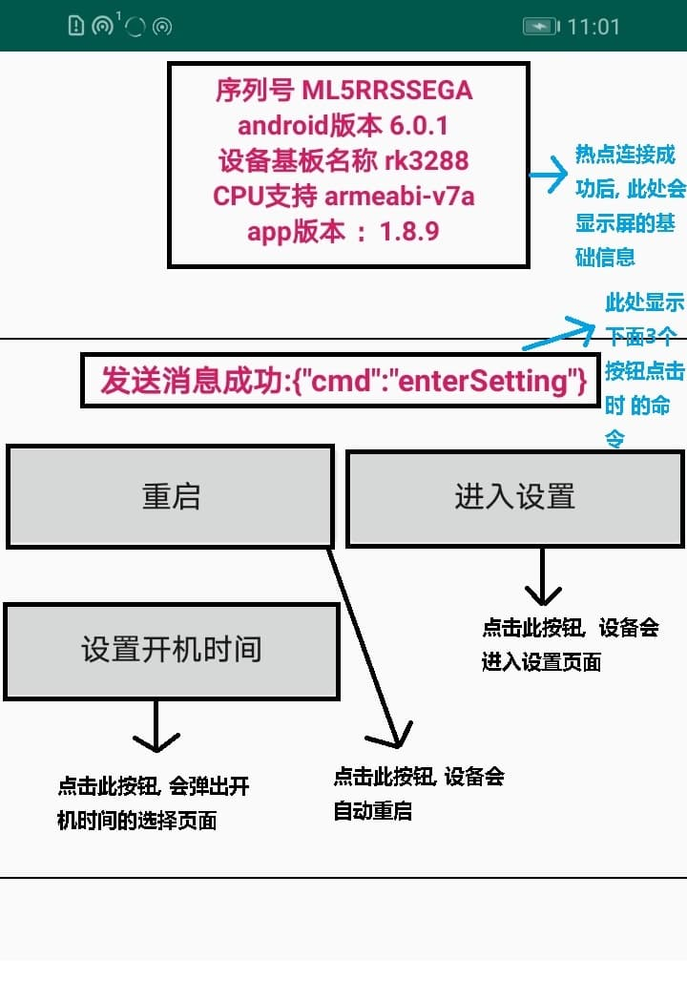
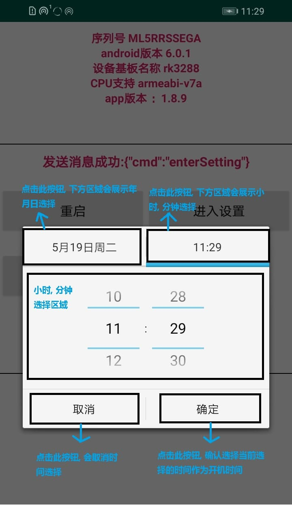

# 手机端设备维护 APP 使用文档

## 准备条件

一步`android4.4以上`手机 , 并确定该手机分享热点给其他设备使用, 同时我们的`RK3288`设备必须连接上, 你的手机所开启的热点

## 操作步骤

## 设备维护 APP 页面介绍图

### 设备维护 APP 首页图

### 年月日选择图

### 小时分钟选择图

## `注意`

1. 在设备关机以后, 如果断电了, 到了开机时间, 也没电, 不能自动开机, 需要等屏有电时, 才会开机
2. 在设备关机以后, 如果断电了, 一会儿又来电了, 尽管还没到开机时间, 屏会自动开机
3. 在选择开机时间时, 务必请选择完小时和分钟, 不然点了确定按钮会提示, 设置时间需要大于当前时间
4. 当前没有设置关机时间, 默认当前时间往后延迟 1 分钟左右, 设备会自动关机
