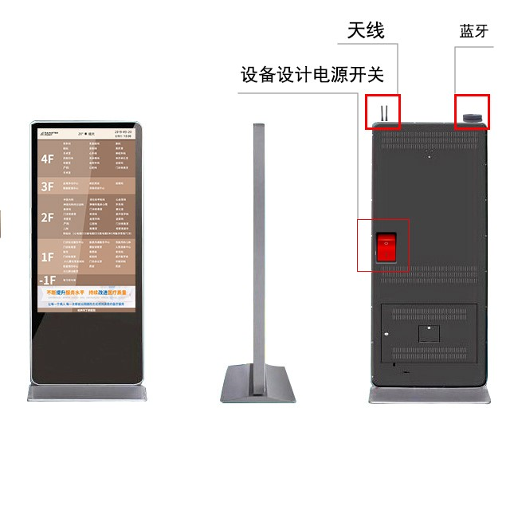
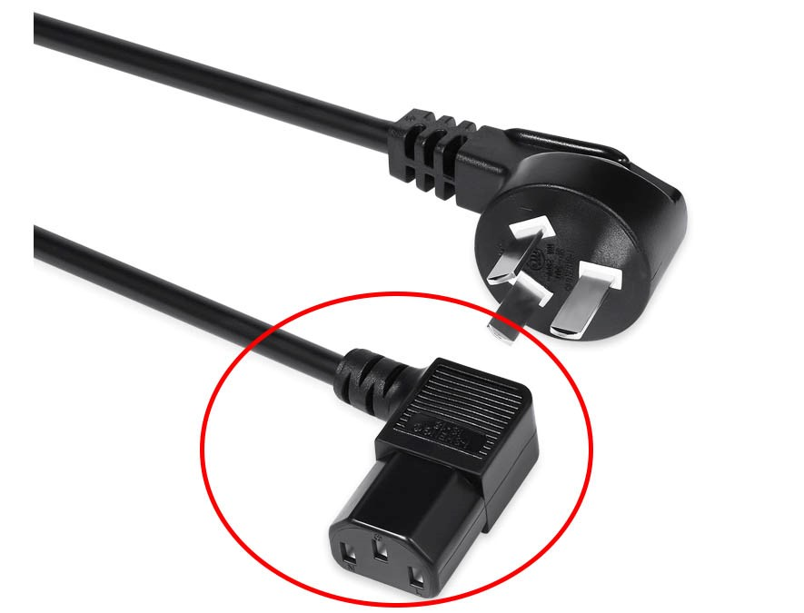

# 智慧标识制作与设备安装须知

## 制作前

### 屏幕

收到智慧标识产品时，请先`检查屏幕`及其配件是否齐备、是否完好。

### 熟悉产品功能

设计制作前需了解并熟悉[智慧标识的功能](../introduction/)及使用方式。

### 安装场景

若安装使用的场景条件`非室内`或较为特殊（包含不限于：暴晒、下雨、下雪、雾霾等场景），请提前与相关人员进行沟通。

产品需要根据现场使用环境及需求在标识牌体上可使用防水、防尘、散热等相关材料或配件。

### 安装位置

产品安装位置推荐参考[产品推荐尺寸与放置位置](../introduction/#产品推荐尺寸与放置位置)，或者向`技术服务人员`寻求帮助。

待安装位置确认后，需要在`施工图纸`上对产品位置进行标注，标注的内容包括：

- 设备类型，描述此处安装的设备类型。
- 设备朝向，施工图纸上标记人面朝设备时的方向指示。

::: warning 特别注意
确定之后屏的位置方向不要随意更改，如要更改屏幕设备方向需要沟通`技术服务人员`更新后台信息。
:::

### 预留空间

设计制作时需预留`屏幕`、`天线`及其配件安装的位置，方便后期调试维护检修，需预留`检修口`、`电源开关`、天线出口开孔。

## 硬件安装

### 屏幕

把屏幕固定在标牌牌体上时，如屏幕带`触控`功能，需提前测试标牌材质是否导`静电`影响触控效果，如该材质影响触控效果时，需增加*隔离层*避免该接材质的与触控屏表面直接接触而影响触控效果。

### 电源线

- 需在牌体上预留电源线走线的空间及其所需出口开孔、并预留检修长度及开关。
- 电源线建议配备`直角电源插头`。

### 4G/WIFI 天线

天线是与屏幕的主板连接的，需预留天线安装的位置及开孔，根据标牌材质、形状、体积等干扰因素，合理规划天线位置。

一般环境下标牌顶部天线外露时信号最佳，**切勿** 将天线完全包裹在金属壳之内。

### 二维码标签

请先用手机扫描二维码，确认与当前点位相同时再进行安装。

### 蓝牙模块

固定在标识牌体上或固定在牌体附近，需考虑安装环境对信号的干扰因素及信号的传输距离确定安装位置，**切勿** 将蓝牙完全包裹在金属壳之内。

### 扫码器模块

扫码器需要连接屏幕 USB 接口使用，需保证接口无遮挡，保留走线的空间。牌体需预留对应扫码的开口，开口位置可用如透明亚克力、透明玻璃等高透光率的材质覆盖。

### 其它智能模块

结合标牌中使用，需考虑安装空间、开孔预留，信号传输距离等因素。

## 环境和外部因素

### 散热

智慧标识出风口不能被遮盖，避免影响散热效果。

### 安装位置

- 智慧标识**禁止**在明火源附近安装。
- 必须按照正确的安装方法将智慧标识牢固地安装在`标牌或固定的支架上`使用，防止对设备的损坏。

### 清洗

智慧标识清洗和维护时设备内部配件**必须**切断电源，液晶显示屏用湿布清洁即可，切勿将液体清洁剂或喷雾清洁剂直接涂在上。

### 设备维护

- 智慧标识的内部设备和电路更换或拆卸**必须**要有专业技术人员的指导下操作，否则生产厂家对由其造成的显示元件的损坏是不负任何责任。
- 智慧标识工作时**禁止**触摸内部电气装置，如因错误的操作造成的人身伤害生产制造商不承担任何责任。
