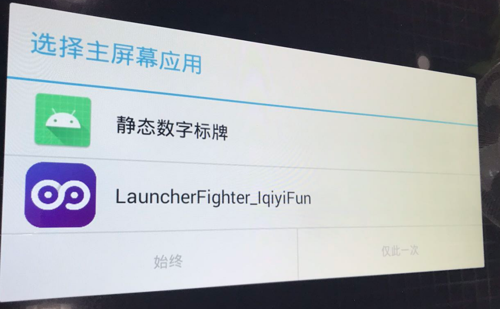

# 静态数字标牌 V1.1.4 问题以及维护

## 运行平台

android 4.4.2 (橙立科技指定厂家)

## 常见问题解答

### 首次安装需要注意什么?

1. 首次安装需要手动使用 U 盘进行安装, 安装完成启动静态数字标牌 app
2. 启动后需要选择主屏幕应用, 使用遥控器选择静态数字标牌, 然后点击下面始终, 选择完成后, 可以断电重启下, 验证开机自启是否正常

   

3. 如果此时设备没有网络, 可以按遥控器上的 `退出`按钮, 即可进入系统的首页, 找到网络设置, 去连接相应的网络

4. 待静态数字标牌处于有网状态进入后, 进入自己的 `管理平台`, 在 `设备管理 -> 未绑定设备`下面找到自己的设备号 进行绑定
5. 绑定完成后重启下静态数字标牌 app, 到此处, 设备已完成激活, 需要自己去设计显示的内容, 然后推送到该设备上

### 静态数字标牌上出现无法获取设备号, 请联系厂家, 需要如何处理 ?

一般这种情况, 会出现在开机自启后, 设备的以太网 MAC 或者 WiFi 的 MAC 地址没有读取到导致的, 这个时候, 需要按遥控器上的 `退出`按钮, 进入系统首页, 去查看网络设置里面的 2 个网卡的 MAC 地址是否存在, 如果存在, 到应用列表里面启动静态数字标牌 app 即可, 启动完成后, 可断电重启静态数字标牌验证设备号是否已成功获取

### 静态数字标牌开机自启时, 屏上出现硬件版本和软件不匹配, 请联系金锐显

这个情况一般是 android 主板的开机自启的替换主屏幕应用失败导致, 可以选择使用 `静态数字标牌1.1.3`

或者更换设备

### 静态数字标牌上显示无法创建 adv 目录

这种情况是静态数字标牌的 `sdcard` 挂载失败了, 重启一次静态数字标牌, 看下能否解决

### 静态数字标牌无法开机自启?

检查静态数字标牌 app 版本是否为 1.1.4, 如果不是, 采用的是广播的开机自启, 该方式不是百分之百成功, 如果可以, 请安装 `静态数字标牌1.1.4版本`

### 管理平台推送资源失败?

首先检查设备是否有网, 如果没网络, 需要手动去设置网络里面连接相应的网络, 如果有网络, 可以重启 `静态数字标牌`, 设备将自动获取最新资源.

### 视频或者图片无法正常显示或者播放?

1. 找到管理平台上的相应的资源文件, 看其预览是否正常, 如果不正常, 请重新上次资源
2. 如果管理平台的资源没问题, 首先找到文件目录, 在找到名称叫 `adv` 的目录, 打开目录找到无法播放的视频或者无法显示的图片, 看下本地点击后, 资源是否是正常的, 如果资源损坏了, 在管理平台上的 `设备详情` 里面点击 `清除按钮`, 就会清除所有文件, 重新进行下载, 看是否能够正常显示和播放了

### 设置的时间或者天气在静态数字标牌上怎么不见了?

这个情况是由于没有网络情况下, 本地时间是错误的, 为了避免错误的显示时间和天气带来的影响, 做了隐藏处理, 如需显示, 需要手动去检查网络并连接好网络
