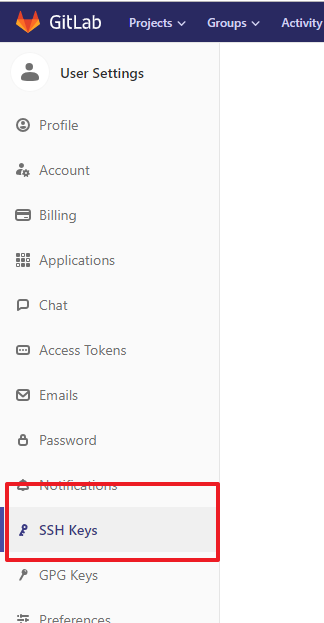
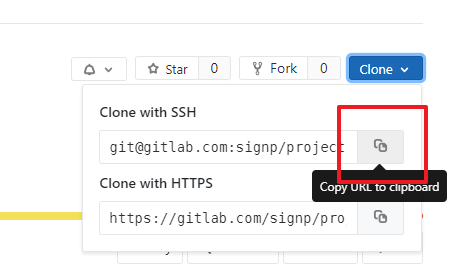

## 开发工具

| 适用性       | 介绍                                            |
| ------------ | ----------------------------------------------- |
| **强烈推荐** | VSCode                                          |
| **可用**     | jetBrain 的大型 IDE, 如 webStorm 等配合相应插件 |

## vscode 插件与配置

| 适用性   | 插件名称                 | 介绍                                             |
| -------- | ------------------------ | ------------------------------------------------ |
| **必须** | ESlint                   | 用于针对需要进行代码标准检查的构建项目的静态检查 |
| **必须** | Git Graph                | 用于查看代码记录与管理的 git 工具                |
| **必须** | Prettier                 | 用于通常项目的代码格式化, 使用默认配置           |
| **必须** | Code Spell Checker       | 用于对英文拼写进行检查提示                       |
| **必须** | Todo Tree                | TODO 标记                                        |
| **必须** | Vetur                    | Vue 官方 vscode 插件                             |
| **必须** | Vue VSCode Snippets      | vue 代码补全                                     |
| **必须** | ES7 React snippets       | ES7, react 代码片段补全                          |
| **推荐** | Bracket Pair Colorizer 2 | 括号高亮                                         |
| **推荐** | change-case              | 名称格式转换(驼峰, 首字母大写, 横线连接)         |

### vscode settings.json

复制下面 json 配置至 settings.json

```json
  "terminal.integrated.shell.windows": "C:/Program Files/Git/bin/bash.exe",
  "eslint.validate": [
    "javascript",
    "javascriptreact",
    "typescript",
    "vue",
    "html"
  ],
  "files.eol": "\n",
  "files.autoSave": "onFocusChange",
  "editor.wordWrap": "on",
  "editor.tabSize": 2,
  "editor.formatOnSave": true,
  "editor.defaultFormatter": "esbenp.prettier-vscode",
  "editor.codeActionsOnSave": {
    "source.fixAll": true
  },
  "[vue]": {
    "editor.defaultFormatter": "octref.vetur"
  },
```

## npm 全局安装扩展

安装方法: `npm i -g XXX`, 尽可能使用 `npm` 而不是 `yarn` 进行全局依赖的安装以便于全局依赖的管理

| 适用性   | 插件名称             | 介绍                                                                                                      |
| -------- | -------------------- | --------------------------------------------------------------------------------------------------------- |
| **必须** | yarn                 | 更快更好用的 npm 工具, 能够保证版本的统一性                                                               |
| **必须** | serve 或 http-server | 在本地方便的启动一个本地 web server, 针对所有需要进行本地开发与测试的项目目录, 包括 Vue, React 的构建目录 |
| **可用** | @vue/cli             | vue 命令行                                                                                                |
| **禁止** | cnpm                 | 国内的 npm 工具, 要求使用 yarn 用于 node 包管理, 能够保证版本的统一性                                     |

## npm 镜像配置

### npm 换源

```bash
# 修改源地址为淘宝 NPM 镜像
npm config set registry https://registry.npm.taobao.org/

# 恢复源地址为官方源
npm config set registry https://registry.npmjs.org/
```

在设置 `registry` 至淘宝镜像后运行 `npm i -g mirror-config-china` 安装镜像配置

### .npmrc 配置

`mirror-config-china` 会自动完成下列配置

可以通过修改 `~/.npmrc` 文件指定 npm 源与相关包的镜像, 常用配置如下

```bash
# npm 源
registry=https://registry.npm.taobao.org/
# electron 镜像源
electron_mirror=https://npm.taobao.org/mirrors/electron/
# sass 镜像源
sass_binary_site=https://npm.taobao.org/mirrors/node-sass/
# puppeteer 镜像源
puppeteer_download_host=https://npm.taobao.org/mirrors
```

## git 配置与使用

### 公司 GitLab 地址

[https://gitlab.com/signp](https://gitlab.com/signp)

### ssh key 生成方法

```bash
#在本地查看email地址
$ git config --list
#如果没有，需要运行
$ git config --global user.name test123
$ git config --global user.email test123@qq.com
# 设置换行符为 LF
git config --global core.autocrlf input
git config --global core.eol lf
#在本地根目录生成公钥:
$ cd
$ ssh-keygen -t rsa -C test123@qq.com
```

复制生成的公钥至服务器中 `~/.ssh/authorized_keys`

### 使用前须知

1. 注册 gitlab 账号
1. 发送 gitlab 账号绑定的邮箱给管理员, 加入公司项目组
1. 复制本地 ssh key 至 gitlab 账号中
   
1. git clone 代码仓库至本地
   

如上图所示, 复制项目 git ssh 地址, 在项目目录下打开命令行, 输入

`git clone git@gitlab.com:signp/project`

## 代码与书写规范

### 基本要求

此配置已写在 [vscode settings.json](#vscode-插件与配置) 配置中

| 适用性   | 说明                                                                                                       |
| -------- | ---------------------------------------------------------------------------------------------------------- |
| **必须** | 使用 `prettier` 用作代码格式化工具, 使用默认配置并整合 `eslint`                                            |
| **必须** | 代码使用空格进行缩进, 且缩进设置为 2 个空格                                                                |
| **必须** | 对于包含 `eslint` 配置的项目, 必须保证 `eslint` 的正常运行与自动格式化, 所有代码编写规范均以 `eslint` 为准 |
| **必须** | 使用 `git bash` 替换 windows 自带命令行工具                                                                |

### 注释与说明

| 适用性   | 说明                                                                                    |
| -------- | --------------------------------------------------------------------------------------- |
| **必须** | 变量的定义, 函数定义以及方法中较难理解或者复杂逻辑的地方**必须**存在注释                |
| **推荐** | 函数的注释使用 `JSDoc` 进行标注, 通常包括简介, 输入的格式与说明, 输出的说明, 使用示例等 |

### 代码书写规范

| 适用性   | 说明                                                                                                                |
| -------- | ------------------------------------------------------------------------------------------------------------------- |
| **必须** | 对于 `Vue` 以及 `React` 等构建项目, 注意保留 `eslint` 静态检查与 `babel` 代码优化输出                               |
| **必须** | 在硬件上运行的页面输出时需要保留 [sourceMap](https://webpack.docschina.org/configuration/devtool/) 输出文件以便调试 |
| **禁止** | 服务器上运行的网页输出时 **禁止** 输出 sourceMap 以防止暴露原始代码                                                 |
| **必须** | 在文档编写中**汉字**与英文, 数字字符串之间增加**空格**, 以便复制与更改                                              |
| **禁止** | 非构建项目或者无兼容处理时, **禁止**使用 ES6 写法, 源码可能因为没有 `polyfill` 而无法运行                           |
| **禁止** | **禁止**在任何地方(**包括注释**)出现汉字标点, 汉字输入法的标点**必须**设置成英文输出                                |

### 文件与目录命名规范

| 适用性   | 说明                                                                                                                 |
| -------- | -------------------------------------------------------------------------------------------------------------------- |
| **禁止** | **禁止**在任何地方使用汉字命名, 包括**说明文档**                                                                     |
| **必须** | 项目名字**必须**使用 `横线连接 (kebab-case)`, **禁止** 使用`驼峰格式`, `大写字母开头`, `下划线连接` 作为项目名字     |
| **必须** | 文件夹名字**必须**使用 `横线连接 (kebab-case)`, **禁止** 使用`驼峰格式`, `大写字母开头`, `下划线连接` 作为文件夹名字 |
| **必须** | 一般文件命名要求使用 `横线连接 (kebab-case)`, **禁止** 使用`驼峰格式`, `下划线连接` 作为文件夹名字                   |
| **必须** | 组件名要求使用 `大写字母开头`, 便于代码编辑器的自动补全                                                              |

### 方法命名规范

方法名、参数名、成员变量、局部变量都统一使用 lowerCamelCase 风格，必须遵从`驼峰形式`。

`正例： localValue / getHttpMessage() / inputUserId`

_其中 method 方法命名必须是 动词, 或者 动词+名词 形式_

`正例：saveShopCarData /openShopCarInfoDialog`

`反例：save / open / show / go`

_特此说明，增删查改，详情统一使用如下 5 个单词，不得使用其他（目的是为了统一各个端）_

`add / update / delete / detail / get`

#### 函数方法常用的动词

| 动词     | 说明 | 动词       | 说明   |
| -------- | ---- | ---------- | ------ |
| get      | 获取 | set        | 设置   |
| add      | 增加 | remove     | 删除   |
| create   | 创建 | destroy    | 移除   |
| start    | 启动 | stop       | 停止   |
| open     | 打开 | close      | 关闭   |
| read     | 读取 | write      | 写入   |
| load     | 载入 | save       | 保存   |
| create   | 创建 | destroy    | 销毁   |
| begin    | 开始 | end        | 结束   |
| backup   | 备份 | restore    | 恢复   |
| import   | 导入 | export     | 导出   |
| split    | 分割 | merge      | 合并   |
| inject   | 注入 | extract    | 提取   |
| attach   | 附着 | detach     | 脱离   |
| bind     | 绑定 | separate   | 分离   |
| view     | 查看 | browse     | 浏览   |
| edit     | 编辑 | modify     | 修改   |
| select   | 选取 | mark       | 标记   |
| copy     | 复制 | paste      | 粘贴   |
| undo     | 撤销 | redo       | 重做   |
| insert   | 插入 | delete     | 移除   |
| add      | 加入 | append     | 添加   |
| clean    | 清理 | clear      | 清除   |
| index    | 索引 | sort       | 排序   |
| find     | 查找 | search     | 搜索   |
| increase | 增加 | decrease   | 减少   |
| play     | 播放 | pause      | 暂停   |
| launch   | 启动 | run        | 运行   |
| compile  | 编译 | execute    | 执行   |
| debug    | 调试 | trace      | 跟踪   |
| observe  | 观察 | listen     | 监听   |
| build    | 构建 | publish    | 发布   |
| input    | 输入 | output     | 输出   |
| encode   | 编码 | decode     | 解码   |
| encrypt  | 加密 | decrypt    | 解密   |
| compress | 压缩 | decompress | 解压缩 |
| pack     | 打包 | unpack     | 解包   |
| parse    | 解析 | emit       | 生成   |
| connect  | 连接 | disconnect | 断开   |
| send     | 发送 | receive    | 接收   |
| download | 下载 | upload     | 上传   |
| refresh  | 刷新 | sync       | 同步   |
| update   | 更新 | revert     | 复原   |
| lock     | 锁定 | unlock     | 解锁   |
| checkOut | 签出 | checkIn    | 签入   |
| submit   | 提交 | commit     | 交付   |
| push     | 推   | pull       | 拉     |
| expand   | 展开 | collapse   | 折叠   |
| begin    | 起始 | end        | 结束   |
| start    | 开始 | finish     | 完成   |
| enter    | 进入 | exit       | 退出   |
| abort    | 放弃 | quit       | 离开   |
| obsolete | 废弃 | depreciate | 废旧   |
| collect  | 收集 | aggregate  | 聚集   |
