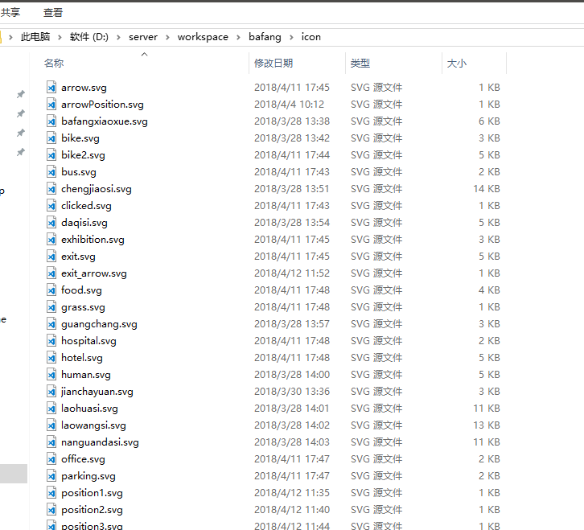
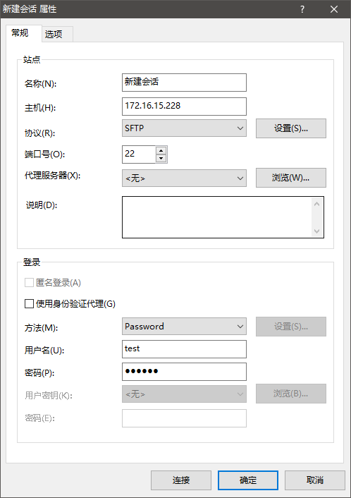
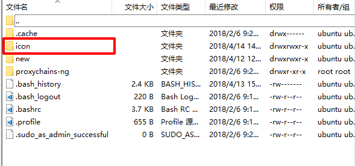
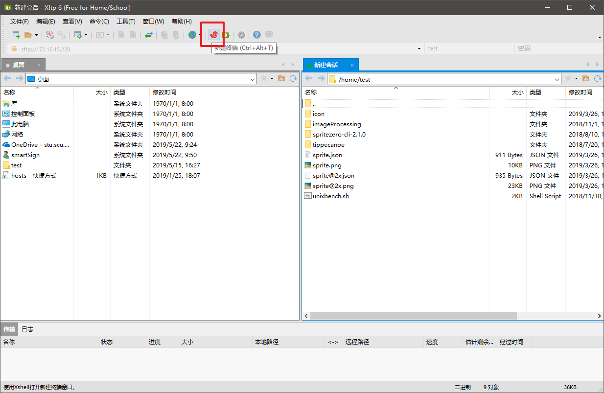
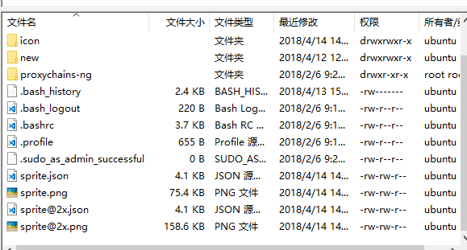

## 使用软件

1. xshell: SSH 软件，用于在 linux 环境下输入指令
2. xftp: FTP 软件，用于上传下载本地-服务器的文件

[软件下载](http://192.168.1.228:9999/lib/f48dc2ac-be0b-417c-acb4-90753fedc580/file/xshell%2Bxftp.zip)

## 使用流程

1. 建立需要生成的雪碧图的 svg 文件夹，命名为 icon
   
2. 使用 xftp 使用 SFTP 的方式连接到 linux 服务器上
   

```
主机： sftp://192.168.1.228
用户名: test
密码：123456
```

3. 使用 xftp 将 icon 文件夹上传到服务器上
   

4. 在 xshell 打开主机，运行以下两个指令
   

```bash
# 生成标准大小雪碧图
spritezero sprite icon/
# 生成手机端高分屏雪碧图
spritezero --retina sprite@2x icon/
```

5. 使用 xftp 下载生成的 sprite.png, sprite.json, sprite@2x.png, sprite@2x.json
   

## 备注

1. svg 图标的标准大小为 64\*64px，对于需要使用不同大小的，要求使用 2 的次方大小像素，如 32，64，128 等
2. svg 图标保存时使用`字体轮廓`
3. svg 图标保存时的 CSS 属性使用`演示文稿属性`或者`样式属性`，切勿使用样式元素。
4. 对于不好进行处理的图标可以使用空的 SVG 文件参与雪碧图的生成，再对生成好的图片使用 PS 进行处理。
5. 文件传输如果使用 ZIP 上传时，需要在服务器上运行 unzip icon.zip 的命令
6. 注意删除与保存 `icon/` 目录
