# 智慧标识系统与产品标准

## 智慧标识

以地理信息系统和大数据为核心，物联网技术为基础，智能标识设备为终端媒介，构建标识物联网。智慧化解决室内空间寻路等问题。

### 发展历程

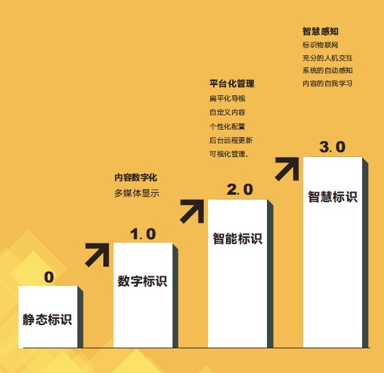

### 系统组成

智慧标识系统由软、硬件两部分组成。

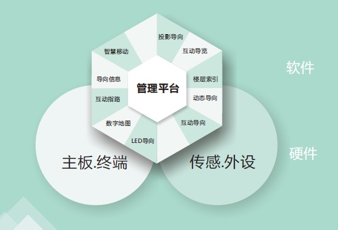

软件部分包括智能管理平台，智慧标识软件。

硬件部分包括智能终端与传感外设部分。

## 智能产品

|    产品    | 说明                                                                                                                                                 |                传统方案                |                 智慧方案                  |
| :--------: | ---------------------------------------------------------------------------------------------------------------------------------------------------- | :------------------------------------: | :---------------------------------------: |
| 互动导览屏 | 互动导览屏是智慧导视系统中用于`地图导览`的交互设备，为用户提供可交互的浏览地图功能，让用户在人机互动中轻松获取所需的导览信息。                       |  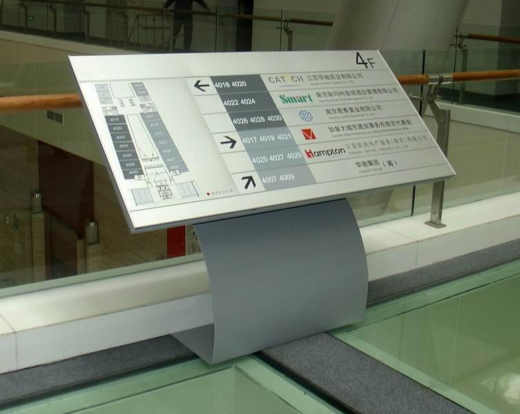  |     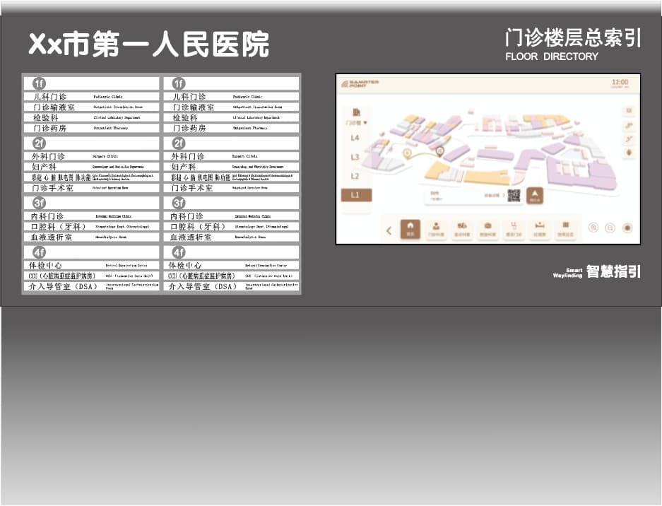      |
| 楼层索引屏 | 楼层索引屏是智慧导视系统中用于展示建筑目录的`智能化楼层索引`类设备，解决了传统索引标牌更新难题。                                                     | 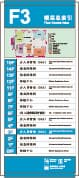 |     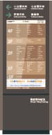      |
| 互动指路屏 | 互动引导屏是智慧导视系统中用于`信息输入`的交互设备，可通过主动搜索目的地，进行全域范围内点对点间包括方向、路线、距离、行程预估时间等信息的智能引导。 |    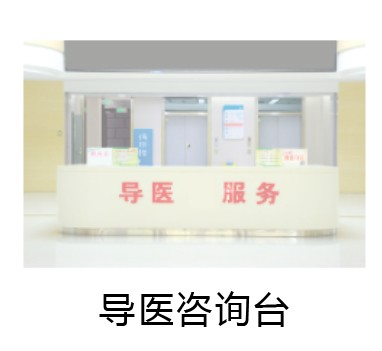     |              |
| 动态导向屏 | 导向屏是智慧导视系统中用于信息展示的智能设备，可同时智能化轮播多个点位的`导向信息`，解决室内大型区域的寻路难题。                                     |   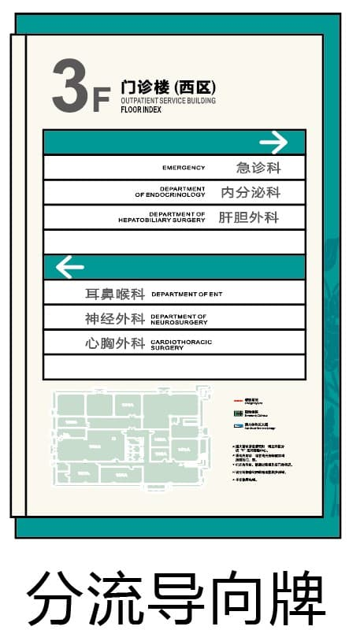   |      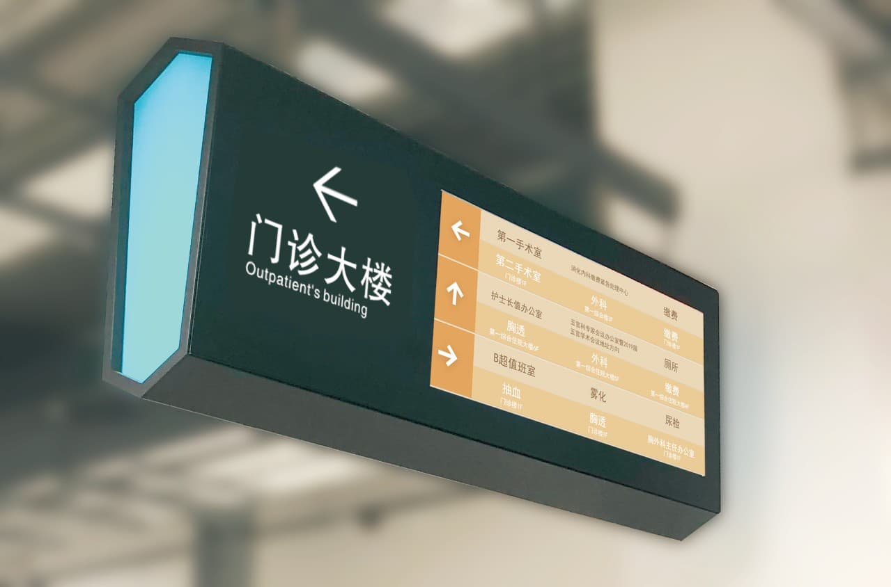      |
| 互动导向屏 | 互动指路屏 + 动态导向屏                                                                                                                              |      | 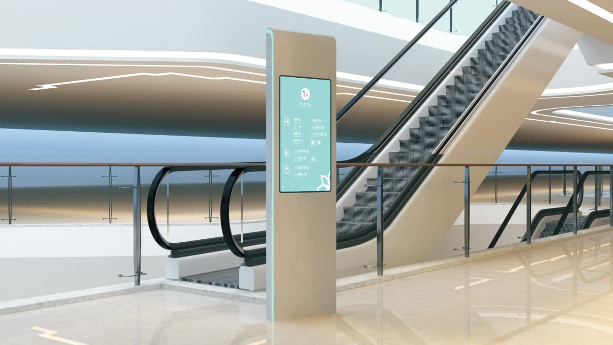 |
| 导向信息屏 | 导向信息屏是智慧导视系统中用于智能化展示`多点导向信息及综合即时信息`的显示设备。                                                                     |      |    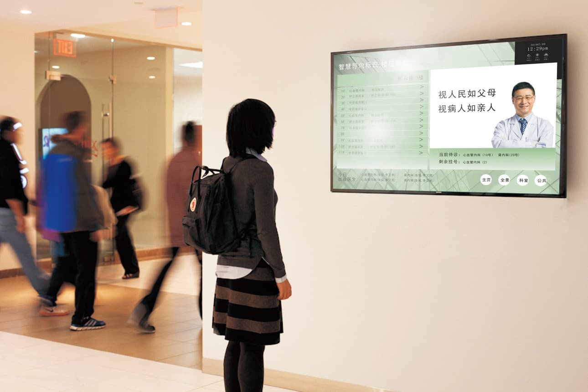     |
| LED 导向屏 | LED 导向屏是智慧导视系统中用于信息展示的`吊挂式智能设备`，采用 LED 数字显示屏，可同时智能化轮播多个点位的导向信息，解决室内大型区域的分流导向难题。  |      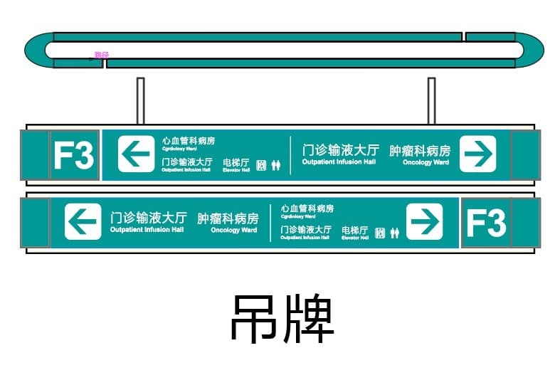      |          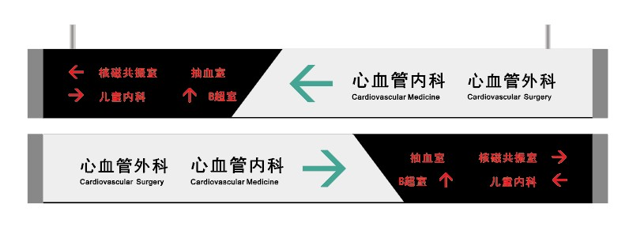          |

## 设计标准

智慧标识的设计标准应借鉴[传统标识的设计规范](../signStandard/#人行导向标识版面设计原则)，结合[设备规格参数](../../equipment/introduction#硬件规格)计算适合和文字边距尺寸。

计算方式为：

$$文字最小值=长轴宽度\div200\div可视距离\times1920$$
$$文字最大值=文字最小值\times2$$
$$图形大小\in[1.5h, 2h]$$
$$英文大小\in[1/3h, 1/2h]$$

其中 `h` 为所用的文字大小。

推荐的文字像素大小如下：

| 尺寸 | 长轴宽度(m) | 可视距离(m) | 文字最小值(px) | 文字最大值(px) |
| ---- | ----------- | ----------- | -------------- | -------------- |
| 13.3 | 0.292       | 0.5         | 16             | 32             |
| 21.5 | 0.477       | 1           | 20             | 40             |
| 27   | 0.599       | 2           | 32             | 64             |
| 32   | 0.699       | 3           | 41             | 82             |
| 42   | 0.941       | 5           | 51             | 102            |
| 49   | 1.077       | 5           | 45             | 90             |
| 55   | 1.209       | 10          | 79             | 158            |
